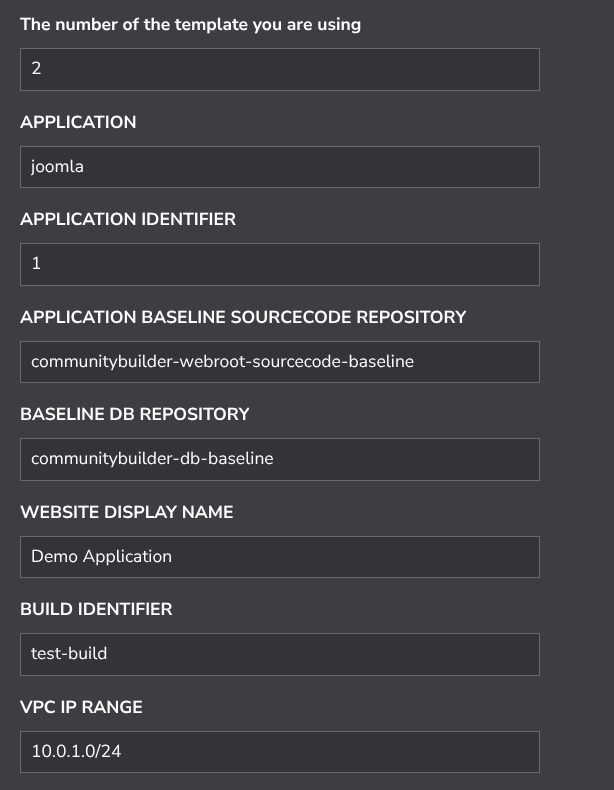
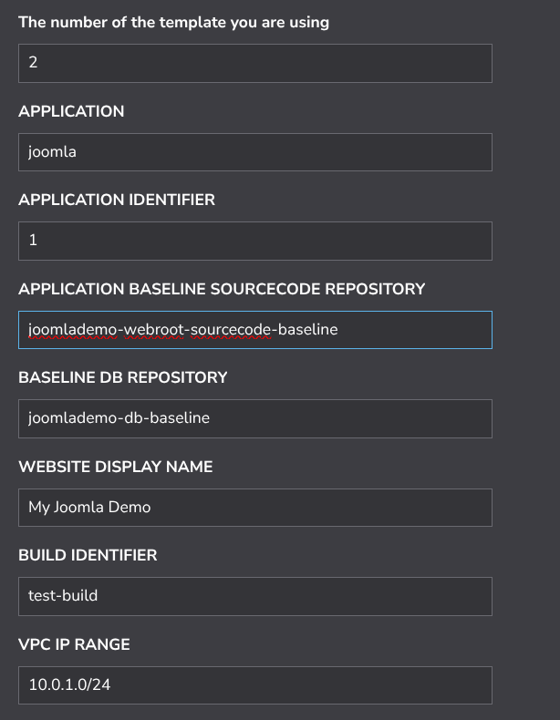

When I mention "Overriding" in reference to a StackScript, this is what I mean.

The supplied [StackScript](https://cloud.linode.com/stackscripts/635271) has default values set for it. These defaults are set to make the demo application as simple to deploy as possible. When you want to deploy a different demo to the "default demo" you will certainly have to override some settings that have been supplied as default values in your StackScript. 

So, taking "Demo 1" [here](./JoomlaDemos.md) I can see that "Demo 1" invites us to override the following settings.

>      set "The Display name for your website e.g. My Demo Website" to "My Joomla Demo"  
>      set "BASELINE DB REPOSITORY" to "joomlademo-db-baseline" 
>      set "APPLICATION BASELINE SOURCECODE REPOSITORY" to "joomlademo-webroot-sourcecode-baseline"

Before I apply the invited overrides in order to build "Demo 1", the original StackScript (with its default values set) looks like this:

 

And then once I have applied the overrides suggested/required, it looks like this:

 

And so the change in values that you see is what it means to override the the values of the supplied StackScript

