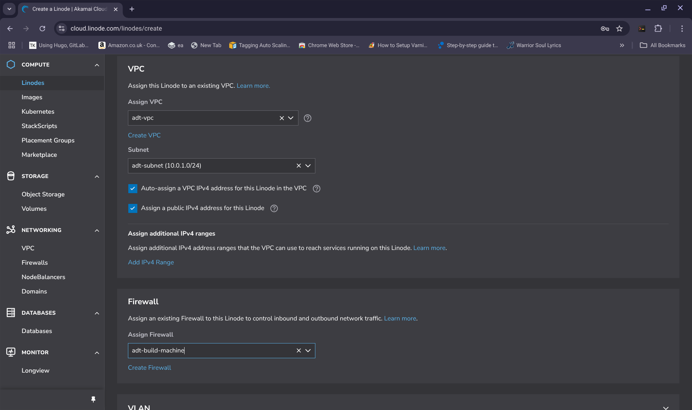

## QUICK-START DEMOS 

**NOTE:** These quick start demos are only intended for use on the Linode platform using the supplied [StackScript](https://cloud.linode.com/stackscripts/635271) to demonstrate example usage cases for the Agile Deployment Toolkit as quickly and easily as possible.  The demos themselves are very quickly put together simply there for illustrative purposes they are not there to provide any truly useful function. If anyone would like to spend time crafting demos useful for real function that could be listed here that would be valued. 

The purpose of these quick start demos is to show you that with just some parameters you can achieve a lot using the Agile Deployment Toolkit with the possibility of going much deeper into it if you choose to.

For more information about parameter configuration please see the [spec](https://github.com/wintersys-projects/adt-build-machine-scripts/blob/main/templatedconfigurations/specification.md) and [quickspec](https://github.com/wintersys-projects/adt-build-machine-scripts/blob/main/templatedconfigurations/quick_specification.dat)

**These initial steps are only required the first time you make a deployment. The result of these first steps can be used repeatedly for subsequent demo deployments.** 

--------------------------
**YOUR FIRST DEMO DEPLOYMENT PREPARATORY STEPS**

--------------------------

You will not need to do these steps multiple times for subsequent demos that you deploy. Once you have the result of these first time only steps you can reuse the result of these steps across you later demo deployments. What this means is that making the first deployment is more work than making any subdequent deployments after that and it's the ease with which subsequent deployments can be made which is the "looked for win" here.  

**OBJECTIVE** At the end of these initial preparatory steps you should have a text file stored and saved on your laptop complete with your own values equivalent to the following:

SAMPLE CONFIGURATION DATA

>     Build Machine User: **"nuocial-deployer"**  
>     Build Machine Password: **"gdjkbcijbue2hhfdy3e8"**  
>     Build Machine SSH PORT: **"1035"**  
>     Laptop IP: **77.99.28.105**  
>     Linode account username : **linode-username**  
>     Linode account email address : **nuocialdeployer@gmail.com**  
>     Laptop public key : **ssh-rsa AAAAB3MbsHaC1Jc2EAA......8X8TGp19n root@penguin**  
>     Object Storage access key : **PJX1HOLT157FQ9WCQ52K**  
>     Object Storage secret key: **malXD6aIPRAlxR2zU3IrpDDFWbNSLoGKLA6T1JeP**  
>     Personal Access Token : **23c8b26866a9fd81634a83182da5e1193bcc73d731d9224732159a8e31989d29**  
>     Live Domain Name: **demo.nuocial.org.uk**  
>     Core Website Name: **nuocial**

**Set up a VPC so that our servers and our build machine are in the same VPC**

Before you do anything, create a VPC in the "gb-lon" region called "adt-vpc" with a subnet of "10.0.1.0/24". The VPC create screen for my requirements looks like:

  

Take note of the subnet, yours should be the same as in the image.

**Set up a native firewall to limit access to only us ourselves**

You should create a native firewall for the linode you are going to deploy. In our case we want to block all connections except from the laptop that we want to allow access to. We create the firewall here, and we will attach it to our build-machine when we go through the steps needed to provision it. 

  
  
  
 
NOTE: The IP address in this next image is the IP address of my laptop in your case it should be the IP address of your laptop which you can find by going to: [whats my ip](https://www.whatsmyip.com)
  
In this last image, you can see that access has been granted only to our SSH port (1035) from the IP address of our laptop. What this means is that once this firewall is attached to our build-machine everything is blocked from access except for our laptop and even then only to the specific ssh port that we have set. 
  

------------------------------------

**To achieve the objective of a text file saved on your laptop with the configuration data needed for your demo deployment, please follow all of these 8 bullet-pointed steps**

- The system needs from you a sample username, a secure password, the ssh port that you want to connect with and the IP address of your laptop.
  You can provide a username of your own choosing, here I chose to make the username "nuocial-deployer"
  You can provide a password of your own choosing, here I chose to use the password "gdjkbcijbue2hhfdy3e8"
  You can choose an appropriate SSH port number I chose to make mine "1035"
  You need to find out what the IP address of your laptop is which you can find out by going to [whats my ip](https://www.whatsmyip.com) in your browser  

>       "Username: nuocial-deployer"
>       "Password: gdjkbcijbue2hhfdy3e8"
>       "Port: 1035"
>       "Laptop IP: 77.99.28.105"  

- If you haven't got a user account with Linode, setup an account with them which you can do at  [Linode](https://www.linode.com)
  The systemm will need to know the username of your linode account (in other words, the username that you used to register with). Here I chose the username of my linode account to be "nuocialdeployer". Make a note of your linode account username in the text file on your laptop.
  The system will also need to know the email address that you registered when you created your Linode account. For me, the email address is "nuocialdeployer@gmail.com"

These values should be added to the text file on your laptop
 
>        "Linode account username : linode-username"  
>        "Linode account email address : nuocialdeployer@gmail.com"

- If you haven't got an appropriate ssh key pair on your laptop, you can follow the "Generate an SSH Key Pair" section if you your laptop is a Linux or a mac based machine and a "Generate a key pair with Putty" section if your laptop machine is a Windows based machine in [this](https://www.linode.com/docs/guides/use-public-key-authentication-with-ssh/) document.  You then need to make a note of the public key that you either already had or that you have generated freshly for this demo set and store it in the credentials file you are building on your laptop. 

>        "Laptop public key : ssh-rsa AAAAB3MbsHaC1Jc2EAA......8X8TGp19n root@penguin"  

- Setup Object Storage for your account if its not already setup according to [Object Storage Setup](https://www.linode.com/docs/products/storage/object-storage/get-started/#generate-an-access-key) - make a note in your text document of the access key and the secret key for your object storage, for example,  

>        "Object Storage access key : PJX1HOLT157FQ9WCQ52K "  
>        "Object Storage secret key: malXD6aIPRAlxR2zU3IrpDDFWbNSLoGKLA6T1JeP"  

- Generate a personal access token with (for the simplicity of this demo, in production you should use the principle of least privileges) all read and write permissions granted according to [Generate Personal Access Token](https://www.linode.com/docs/products/tools/api/guides/manage-api-tokens/#create-an-api-token) - make a note of your PAT in your text document for example,  

>        "Linode Personal Access Token : 23c8b26866a9fd81634a83182da5e1193bcc73d731d9224732159a8e31989d29"  

- Purchase a domain if you don't have one [fasthosts](https://www.fasthosts.co.uk) and change the nameservers of the domain to "**ns1.linode.com, ns2.linode.com, ns3.linode.com, ns4.linode.com and ns5.linode.com**" with your domain registrar (if you don't know how to purchase a domain and change its active nameservers, then, this toolkit probably isn't suitable for you). 

- You now need to make a note of the domain name you are using to deploy to, for example, if I have just purchased as set up a domain "**nuocial.org.uk**" and my intended domain name for my final demo website is to be available at"**demo.nuocial.org.uk**" I need to  make a note of this in my text file  

>        "Live Domain Name: demo.nuocial.org.uk"

You now need to update your linode DNS system with your new domain name. Click on "**Domains**" from the Linode GUI and add your domain name as a "**Primary Domain**" to the Linode DNS system in my case the primary domain will be "**nuocial.org.uk**"

- You need to make a note of the "core website name" which is "**nuocial**" if your domain name is "**demo.nuocial.org.uk**" and "testwebsite" if your domain name is "demo.testwebsite.uk"

>      "Core website name: nuocial"

-----------------------

You should now have a **text file on your laptop** that looks similar to my sample/example configuration parameters I showed you above. If you don't have all equivalent details to those listed your build definitely won't succeed.   

**Enter the values that you have in your text file into the "AgileDeploymentToolkitDemo" Stackscript.**

1. Go to "**Stackscripts**" from the GUI system of your Linode Account and find the public Stackscript "**AgileDeploymentToolkitDemo**" and click "**Deploy Linode**" 

2. You will then see a list of configurable text-fields that you are going to selectively enter the data from the text file you now have on your laptop. Each text-field has a label and so to configure the Stackscript, find the label as I mention it below and enter the corresponding value from your text file into that text-field

3. Label: **"SSH Public Key from your laptop (required)"** - value from YOUR text file which in my case is **"AAAAB3MbsHaC1Jc2EAA......8X8TGp19n root@penguin"**

4. Label: **"The username for your build machine user (required)"** - example value which in my case is **"nuocial-deployer"**

5. Label: **"The password for your build machine user (required)"** - example value which in my case is **"gdjkbcijbue2hhfdy3e8"**

6. Label: **"The SSH port for your build machine (required)"** - example value which in my case is **"1035"**

7. Label: **"IP address of your laptop (required)"** - value from YOUR text file which in my case is **"111.111.111.111"**

8. Label: **"The username of your Linode account (required)"** - value from YOUR text file which in my case is **"linode-username"**

9. Label: **"The S3 access key for your linode object storage (required)"** - example value which in my case is **"PJX1HOLT157FQ9WCQ52K"**

10. Label: **"The S3 secret key for your linode object storage (required)"** - example value which in my case is 
**"malXD6aIPRAlxR2zU3IrpDDFWbNSLoGKLA6T1JeP"**

11. Label: **"Your linode personal access token (which must have all necessary rights granted) (required)"** - example value which in my case is **"23c8b26866a9fd81634a83182da5e1193bcc73d731d9224732159a8e31989d29"**

12.  Label: **"The email address of your DNS provider (required)"** - example value which in my case is the same email address as my linode account sign up email - **"nuocialdeployer@gmail.com"**

13.  Label: **"The access token for your DNS provider (required)"** - same as your PAT which in my case is **"23c8b26866a9fd81634a83182da5e1193bcc73d731d9224732159a8e31989d29"**

14. Label: **"The domain name of your website which must be registered with your DNS provide"** - example value which in my case is **"demo.nuocial.org.uk"**

15. Label: **"Website name if url is www.nuocial.org.uk this is nuocial (required)"** - example value which in my case is **"nuocial"**

---------------------------------------------------------------

Before you click "Create Linode" at the bottom of the page make sure that you are creating this build machine Linode in the correct region (gb-lon), attach the build machine you are provisioning to the adt-vpc that you created above remembering to "**Assign a public IPv4 address for this Linode**", that the Linode has a root password set. If you understand what you are doing, then the rest of the settings for your linode are left to your discretion.

Once you click "**Create Linode**", the build will deploy which will take some minutes. 

In graphical format the process of configuring your build machine for deployment should look similar to the following set of images:
  
  
  
  
  
  
  
  

Once the build is completed:

# OBTAIN BUILD MACHINE IP ADDRESS (IMAGE)

You can ssh onto the build machine once it has started up with

>      ssh -p 1035 nuocial-deployer@<build-machine-ip>

then do a

>      sudo su <password as per step 4 above>
>      cd adt-build-machine-scripts
>      ./Logs.sh

**Note 1:**

Be aware that a new SSL certificate is issued each time you run this Stackscript which means that if you do multiple deployments you will run into "rate limiting" problems. If you need to perform multiple build cycles for a particular domain you are best off using the expedited method as described [here](<../Tutorials/linode/FOLLOW ME.md>). You can also set SSL_LIVE_CERT to 0 to use a staging certificate which doesn't have such restrictive rate limiting as a production certificate but it will likely give you a browser security warning when you access your website. 

**Note 2:**

Once your machines are built the firewall will be installed on your build machine (the machine that was built using the StackScript) but you can tighten what the firewall configuration provided by default by creating an additional firewall called "adt-build-machine" through your linode gui adding the build machine to it and creating a rule to only allow access from your "LAPTOP IP" mentioned above to the "Build Machine SSH PORT" mentioned above. This will tighten up the security of your build machine to only allow SSH access from your laptop and to the specific port you have configured SSH to use through your selection. All the other ports on your build machine will be firewalled off making it more difficult to compromise because it has sensitive access keys and secret keys on it. This will give you two layers of tightly configured fire walling for your build machine the native firewall which you optionally set up manually as just described and the ufw/iptables firewalling that is set up automatically. 

**Note 3:**

These are only demos and use naked DNS configurations (meaning no proxying through a service to facilitate a WAF and so on). If you want to get more serious you very likely will want to configure Cloudflare or run one of our [authentication server](../Operations/AuthenticationServer.md) setups that provide a solution for zero trust access to your webproperty. You can also modify the toolkit to use a different WAF provider to Cloudflare if you choose because there are other options. 

**Note 4:**

Once the build has completed you might have to give the Linode DNS system a few minutes to refresh with the IP address that has been added for this build. 

**Note 5:** 

If you are using the Linode DNS system which you are by default then you might need to clear your broswer's DNS cache between deployments for the website to display. In Chrome you can do this by going to "**chrome://net-internals/#dns**"

--------------------------
**After you have performed all the pre-requisite steps above, you can choose which demo you want to follow from those listed below**

--------------------------

### Demo 1 (Sample Community Builder Joomla application) 

[Community Builder](https://www.joomlapolis.com)

1. Follow the all the pre-requisite at the top of this page 
2. You can play with additional settings such as machine size and so on in any of these demos, but, this first demo application should install without needing any additional steps above and beyond what is outlined in the pre-requisite steps.   
3. Once the application is installed, the username is "webmaster" and the password is "mnbcxz098321QQZZ". There are also test users and their usernames and passwords are: "testuser1" and "mnbcxz098321QQZZ" and "testuser2" "mnbcxz098321QQZZ"

---------------------------

### Demo 2 (Sample Joomla Application)

This is just a sample joomla install with some sample data installed 

1. Follow the all the pre-requisite at the top of this page 
2. Once the pre-requisite steps are all followed, also alter the following settings in your Stackscript: 
 
>      "The Display name for your website e.g. My Demo Website" to "My Joomla Demo"  
>      "BASELINE DB REPOSITORY" to "joomlademo-db-baseline" 
>      "APPLICATION BASELINE SOURCECODE REPOSITORY" to "joomlademo-webroot-sourcecode-baseline"  

---------------------------

### Demo 3 (Sample Joomla Astroid Application) 

[Astroid Framework](https://astroidframe.work/)

This is just a sample joomla install with the astroid framework installed

1. Follow the all the pre-requisite at the top of this page 
2. Once the pre-requisite steps are all followed, also alter the following settings in your Stackscript:   
 
>      "The Display name for your website e.g. My Demo Website" to "My Astroid Demo"   
>      "BASELINE DB REPOSITORY" to "astroid-db-baseline" 
>      "APPLICATION BASELINE SOURCECODE REPOSITORY" to "astroid-webroot-sourcecode-baseline"   

Once the application is installed, the username is "admin" and the password is "mnbcxz098321QQZZ"

----------------------------
### Demo 4 (Sample Joomla Kunena Application) 

[Kunena](https://www.kunena.org)

This is just a sample joomla install with the kunena forum installed

1. Follow the all the pre-requisite at the top of this page 
2. Once the pre-requisite steps are all followed, also alter the following settings in your Stackscript: 
 
>     "The Display name for your website e.g. My Demo Website" to "My Kunena Demo"   
>     "BASELINE DB REPOSITORY" to "kunena-db-baseline" 
>     "APPLICATION BASELINE SOURCECODE REPOSITORY" to "kunena-webroot-sourcecode-baseline"   

Once the application is installed, the username is "webmaster" and the password is "mnbcxz098321QQZZ"

----------------------------

### Demo 5 (Sample Joomlart Free Templates Example Applications) 

1. Follow the all the pre-requisite at the top of this page 
2. Once the pre-requisite steps are all followed, also alter the following settings in your Stackscript: 

#### Demo JA Template One  

[Joomlart Purity](https://www.joomlart.com/joomla/templates/ja-purity-iv)
This is just a sample joomla install with the purity template installed 

>     "BASELINE DB REPOSITORY" to "purity-db-baseline" 
>     "APPLICATION BASELINE SOURCECODE REPOSITORY" to "purity-webroot-sourcecode-baseline"   

OR  

#### Demo JA Template Two  
[Joomlart Stark](https://www.joomlart.com/joomla/templates/ja-stark)
This is just a sample joomla install with the stark template installed 

>     "BASELINE DB REPOSITORY" to "stark-db-baseline" 
>     "APPLICATION BASELINE SOURCECODE REPOSITORY" to "stark-webroot-sourcecode-baseline"  

OR 

#### Demo JA Template Three  
[Joomlart Campaign](https://www.joomlart.com/joomla/templates/ja-campaign)
This is just a sample joomla install with the stark template installed 

>     "BASELINE DB REPOSITORY" to "campaign-db-baseline" 
>     "APPLICATION BASELINE SOURCECODE REPOSITORY" to "campaign-webroot-sourcecode-baseline"    

Once the application is installed, the username is "webmaster" and the password is "mnbcxz098321QQZZ"

----------------------------

### Demo 6 (Sample Wordpress Application)

This is just a sample wordpress template with some sample data installed which will show you how you can get a pre-built site up and running with this toolkit

1. Follow the all the pre-requisite at the top of this page 
2. Once the pre-requisite steps are all followed, also alter the following settings in your Stackscript: 
 
>     "The Display name for your website e.g. My Demo Website" to "My Wordpress Demo"  
>     "APPLICATION" to "wordpress"  
>     "APPLICATION IDENTIFIER" to "2"  
>     "BASELINE DB REPOSITORY" to "wordpressdemo-db-baseline" 
>     "APPLICATION BASELINE SOURCECODE REPOSITORY" to "wordpressdemo-webroot-sourcecode-baseline"  

---------------------------

### Demo 7 (Sample Drupal Application)

[Opensocial](https://getopensocial.com)

1. Follow the all the pre-requisite at the top of this page 
2. Once the pre-requisite steps are all followed, also alter the following settings in your Stackscript: 
 
>     "The Display name for your website e.g. My Demo Website" to "My Opensocial Demo"  
>     "APPLICATION" to "drupal"  
>     "APPLICATION IDENTIFIER" to "3"  
>     "BASELINE DB REPOSITORY" to "opensocial-db-baseline" (with sample data) or "opensocialvanilla-db-baseline" (without sample data)  
>     "APPLICATION BASELINE SOURCECODE REPOSITORY" to "opensocial-webroot-sourcecode-baseline" (with sample data) or "opensocialvanilla-webroot-sourcecode-baseline" (without sample data)  

Once the application is installed, the username is "webmaster" and the password is "mnbcxz098321QQZZ"  

---------------------------

### Demo 8 (Virgin Joomla install)  

1. Follow the all the pre-requisite at the top of this page 
2. Once the pre-requisite steps are all followed, also alter the following settings in your Stackscript: 

>     "The number (1, 2 or 3) of the template you are using" to "1"  
>     "The Display name for your website e.g. My Demo Website" to "My Joomla Demo"  
>     "APPLICATION" to "joomla"  
>     "APPLICATION IDENTIFIER" to "1"  
>     "JOOMLA VERSION" and set it to the latest version of Joomla for example, "5.1.2"  
>     "BUILD CHOICE" to "0"  
>     "BUILD ARCHIVE CHOICE" to "virgin"  
>     "BASELINE DB REPOSITORY" to "VIRGIN"  
>     "APPLICATION BASELINE SOURCECODE REPOSITORY" to "JOOMLA:5.1.2"  

You can then deploy your Linode using your Stackscript and wait for your Joomla install will come online at the URL you specified in your stackscript

To find your database credentials log on to your build machine and do the following:

>     root@localhost:/home/agile-deployer/adt-build-machine-scripts# ./Log.sh
>     Which cloudhost do you want to view logs for DigitalOcean (do), Exoscale (exo), Linode (lin) or Vultr (vul)
>     Please type one of do, exo, lin, vul
>     lin
>     What is the build identifier you want to connect to?
>     You have these builds to choose from: 
>     testbuild
>     Please enter the name of the build of the server you wish to connect with
>     testbuild
>     tail (t) or cat (c) or vim (v)
>     c
>     Do you want out (1) or err (2) or stat (3)
>     1
>     ###############################################################################################################################
>     OK, I'll be kind and show you one time your joomla database credentials
>     Please make a note of them but remember to keep them safe and secret
>     You can enter them in the GUI system when you install the application
>     #########################################
>     Database name: nictmksgrn
>     Database username: u6jy8wvuru
>     Database password: pp7jem8cnp
>     #########################################
>     The database public IP address is: 172.236.3.58
>     The database private IP address is: 10.0.1.4 (try this one first from your application if it timesout, try the public one)
>     The database port is 2035
>     You can make up your own database prefix but make sure to include the '_' character at the end of your prefix (for example 'dbprefix_')
>     #########################################
>     You are not using the default port for your database
>     REMEMBER to tell joomla this by putting the database hostname as 10.0.1.4:2035 when you enter it in the GUI during the install process

You will need to wait for a minute before the _J security check file is removed which this system does automatically for you before you can proceed to completion of the installation

---------------------------

### Demo 9 (Virgin Wordpress install)  

1. Follow the all the pre-requisite at the top of this page 
2. Once the pre-requisite steps are all followed, also alter the following settings in your Stackscript: 

>     "The number (1, 2 or 3) of the template you are using" to "1"  
>     "The Display name for your website e.g. My Demo Website" to "My Wordpress Demo"  
>     "APPLICATION" to "wordpress"  
>     "APPLICATION IDENTIFIER" to "2"  
>     "BUILD CHOICE" to "0"  
>     "BUILD ARCHIVE CHOICE" to "virgin"  
>     "BASELINE DB REPOSITORY" to "VIRGIN"  
>     "APPLICATION BASELINE SOURCECODE REPOSITORY" to "WORDPRESS"    

You can then deploy your Linode using your Stackscript and wait for your Wordpress install will come online 

To find your database credentials log on to your build machine and do the following:

>     root@localhost:/home/agile-deployer/adt-build-machine-scripts# ./Log.sh
>     Which cloudhost do you want to view logs for DigitalOcean (do), Exoscale (exo), Linode (lin) or Vultr (vul)
>     Please type one of do, exo, lin, vul
>     lin
>     What is the build identifier you want to connect to?
>     You have these builds to choose from: 
>     testbuild
>     Please enter the name of the build of the server you wish to connect with
>     testbuild
>     tail (t) or cat (c) or vim (v)
>     c
>     Do you want out (1) or err (2) or stat (3)
>     1
>     OK, I'll be kind and show you one time your wordpress database credentials.
>     Please make a note of them but remember to keep them safe and secret
>     You can enter them in the GUI system when you install the application
>     #########################################
>     Database name: nmrwrhhgqn
>     Database username: u34krmarsu
>     Database password: pxkrdithvp
>     #########################################
>     The database public IP address is: 172.237.96.84
>     The database private IP address is: 10.0.1.5 (try this one first from your application if it timesout, try the public one)
>     The database port is 2035
>     You can make up your own database prefix but make sure to include the '_' character at the end of your prefix (for example 'dbprefix_')
>     #########################################
>     You are not using the default port for your database
>     REMEMBER to tell wordpress this by putting the database hostname as 10.0.1.5:2035 when you enter it in the GUI during the install process
>     ######################################
>     =========================================================================================================================================
>     If you have trouble accessing your new wordpress site, one thing that might be wrong is permalinks within wordpress
>     In this case, go to https://<dns-name>/wp-admin, login and rebuild permalinks under settings->permalinks
 
-----------------------

### Demo 10 (Virgin Drupal install)  

1. Follow the all the pre-requisite at the top of this page 
2. Once the pre-requisite steps are all followed, also alter the following settings in your Stackscript:   

>     "The number (1, 2 or 3) of the template you are using" to "1"  
>     "The Display name for your website e.g. My Demo Website" to "My Drupal Demo" 
>     "APPLICATION" to "drupal"   
>     "APPLICATION IDENTIFIER" to "3"  
>     "DRUPAL VERSION" set it to the latest version of drupal for example, "10.0.10" 
>     "BUILD CHOICE" to "0"  
>     "BUILD ARCHIVE CHOICE" to "virgin"   
>     "BASELINE DB REPOSITORY" to "VIRGIN"  
>     "APPLICATION BASELINE SOURCECODE REPOSITORY" to "DRUPAL:10.0.10"   

You can then deploy your Linode using your Stackscript and wait for your Drupal install will come online  

You will see a message asking you to remove _J* file from the installation folder. Once you see this message wait until your system clock on your laptop cycles to the next minute and the system will have deleted it for you. You can then scroll down and click "Install Joomla" 

**Note:**   

You can install a vanilla copy of [OpenSocial](https://www.getopensocial.com/) instead of a version of Drupal by making the following adjustments to the 8 steps outlined above for demo 10 

>     "APPLICATION BASELINE SOURCECODE REPOSITORY" to "DRUPAL:social" 

**IMPORTANT**   

and at the time of writing, PHP8.1 is the supported version for opensocial so you need to also set  
>     "PHP VERSION" to "8.1"

Change the value 
>     "The Display name for your website e.g. My Demo Website" to "My Opensocial Demo"  
>     "APPLICATION BASELINE SOURCECODE REPOSITORY" to "DRUPAL:social"  

>     root@localhost:/home/agile-deployer/adt-build-machine-scripts# ./Log.sh
>     Which cloudhost do you want to view logs for DigitalOcean (do), Exoscale (exo), Linode (lin) or Vultr (vul)
>     Please type one of do, exo, lin, vul
>     lin
>     What is the build identifier you want to connect to?
>     You have these builds to choose from: 
>     testbuild
>     Please enter the name of the build of the server you wish to connect with
>     testbuild
>     tail (t) or cat (c) or vim (v)
>     c
>     Do you want out (1) or err (2) or stat (3)
>     1
>     OK, I'll be kind and show you one time your drupal database credentials.
>     Please make a note of them but remember to keep them safe and secret
>     You can enter them in the GUI system when you install the application
>     #########################################
>     Database name: n0i6qxap3n
>     Database username: uxzpsfznqu
>     Database password: pvhflpebvp
>     #########################################
>     The database public IP address is: 172.236.31.76
>     The database private IP address is: 10.0.1.4 (try this one first from your application if it timesout, try the public one)
>     The database port is 2035
>     You can make up your own database prefix but make sure to include the '_' character at the end of your prefix (for example 'dbprefix_')
>     #########################################
>     ####################################################################
>     Waiting for the application install to have been completed at: https://<dns-url>/core/install.php
>     Use the credentials listed above please

--------------------------

### Demo 11 (Virgin Moodle install)  

1. Follow the all the pre-requisite at the top of this page 
2. Once the pre-requisite steps are all followed, also alter the following settings in your Stackscript:  

>     "The number (1, 2 or 3) of the template you are using" to "1"  
>     "The Display name for your website e.g. My Demo Website" to "My Moodle Demo"  
>     "APPLICATION" to "moodle"  
>     "APPLICATION IDENTIFIER" to "4"  
>     "BUILD CHOICE" to "0"  
>     "BUILD ARCHIVE CHOICE" to "virgin"  
>     "BASELINE DB REPOSITORY" to "VIRGIN"  
>     "APPLICATION BASELINE SOURCECODE REPOSITORY" to "MOODLE"   

You can then deploy your Linode using your Stackscript and wait for your Moodle install will come online  
Once moodle is installed, I go to demo.nuocial.org.uk/moodle and you should do the same for your domain.

>     OK, I'll be kind and show you one time your moodle database credentials.
>     Please make a note of them but remember to keep them safe and secret
>     You can enter them in the GUI system when you install the application
>     #########################################
>     Database name: nhoz7thefn
>     Database username: ua2dtr1wbu
>     Database password: panh53iiap
>     #########################################
>     The database public IP address is: 172.236.8.173
>     The database private IP address is: 10.0.1.4 (try this one first from your application if it timesout, try the public one)
>     The database port is 2035
>     You can make up your own database prefix but make sure to include the '_' character at the end of your prefix (for example 'dbprefix_')
>     #########################################
>     ####################################################################
>     Moodle should be available at: https://<your-dns>/moodle
>     ####################################################################

----------------------------

### Demo 12 (Sample Virgin Joomla Install from a Baseline Repository)

This is just a sample joomla install there's no sample data or anything it just shows you how you could baseline a virgin joomla installation for maximum ease when making repeated virgin CMS deployments. You can do the same thing for Wordpress, Drupal or Moodle if you chose to. The advantage to creating a baseline of a virgin installation of a CMS is that you don't have to enter any parameters into the application GUI because the system deals with it all for you and so you can make faster deployments once you have a baseline to build from. The disadvantage is that you have to update the installed CMS from the administrator backend to the latest version because the baseline you made some weeks/months ago will be several releases back from current.

1. Follow the all the pre-requisite at the top of this page 
2. Once the pre-requisite steps are all followed, also alter the following settings in your Stackscript: 

>     "The number (1, 2 or 3) of the template you are using" to "2"  
>     "The Display name for your website e.g. My Demo Website" to "My Vanilla Joomla Installation"  
>     "APPLICATION" to "joomla"  
>     "APPLICATION IDENTIFIER" to "1"  
>     "BASELINE DB REPOSITORY" to "joomla5.2.5-db-baseline" 
>     "APPLICATION BASELINE SOURCECODE REPOSITORY" to "joomla5.2.5-webroot-sourcecode-baseline"

Wait for the application install to have been completed and available at:

>      https://<dns-url>

