## QUICK-START DEMOS  

**NOTE:** These quick start demos are only intended for use on the Linode platform using the supplied [StackScript](https://cloud.linode.com/stackscripts/635271) to demonstrate example usage cases for the Agile Deployment Toolkit as quickly and easily as possible.  The demos themselves are very quickly put together simply there for illustrative purposes they are not there to provide any truly useful function. If anyone would like to spend time crafting demos useful for real function that could be listed here that would be valued. 

The purpose of these quick start demos is to show you that with just some parameters you can achieve a lot using the Agile Deployment Toolkit with the possibility of going much deeper into it if you choose to.

For more information about parameter configuration please see the [spec](https://github.com/wintersys-projects/adt-build-machine-scripts/blob/main/templatedconfigurations/specification.md) and [quickspec](https://github.com/wintersys-projects/adt-build-machine-scripts/blob/main/templatedconfigurations/quick_specification.dat)

**These initial steps are only required the first time you make a deployment. The result of these first steps can be used repeatedly for subsequent demo deployments.** 

--------------------------
**YOUR ONE TIME INITIAL PREPARATORY STEPS**

--------------------------

#### Pre-requisites:

- A personal laptop with access to a linux shell
- A user account with sudo or administrative privileges
- Terminal or command line access

#### Step 1 (Get a Linux Laptop):

Go to the linux shell on your laptop. Create a text file in your home directory called "adt-credentials.txt"

>     /bin/echo "Agile Deployment Toolkit Quick Start Demos Essential Credentials" > ~/adt-credentials.txt

---------------------------------

#### Step 2 (Setting up an SSH Keypair on your laptop):

- If you have an existing SSH Key-pair you want to use that is available from your local linux terminal simply save a copy of your public key to your **~/adt-credentials.txt** file from step 1 above for ease of reference later on, for example:

>     /bin/cat ~/.ssh/id_rsa.pub >> ~/adt-credentials.txt

- You do not have a SSH Keypair then its necessary to generate and configure them now.

[Setup SSH Keys For Your Personal Laptop](./SetupSSHKeysOnLaptop.md)

------------------------------------

#### Step 3 (Recording the IP address of your latop machine)

1. Issue the following command from your linux terminal on your laptop

>     /usr/bin/curl ifconfig.me

This will give you your laptop IP address, for example:

>     125.78.43.32

Record your laptop ip address to your **~/adt-credentials.txt** file for future reference, for example, as follows:

>     /bin/echo "MY LAPTOP IP ADDRESS 125.78.43.32" >> ~/adt-credentials.txt

NOTE: you can also use services such as [whats my ip](https://whatsmyip.com) if you prefer 

-----------------

#### Step 4 (Setting up a Linode Account)

1. If you don't have a Linode account then you can setup a new Linode account for yourself by following: [Setup Linode Account](https://techdocs.akamai.com/cloud-computing/docs/getting-started). You are advised to setup two factor authentication to protect your account. 

Once your account is setup record the username that you registered with as well as the email address that you used to register. So, for example:

>     /bin/echo "MY LINODE USERNAME : adtdemosuser" >> ~/adt-credentials.txt
>     /bin/echo "MY LINODE EMAIL : adtdemos@gmail.com" >> ~/adt-credentials.txt

-------------------

#### Step 5 (Setting up a full access Personal Access Token on your Linode Account)

1. To set up a Personal Access token for Linode you can follow [here](https://techdocs.akamai.com/cloud-computing/docs/manage-personal-access-tokens). For the purpose of this demo, you want full acccess rights (its lazy but simple) and you can do that by clicking the an "access value" of "Select all" and "Read/Write" in other words, the circle at the top right of the grid of access rights when it displays. When you generate your personal acccess token it will be displayed to you and you should add it to your **~/adt-credentials.txt** file before you dismiss it, for example,

>      /bin/echo "MY LINODE PAT: difhinrgfgi84f9j4f9j302rrijfubnervggihjjregi34nfin4fine4fi2" >> ~/adt-credentials.txt

--------------------

#### Step 6 (Setting up Linode Object Storage access keys)

1. To setup Object Storage Access Keys, follow [here](https://techdocs.akamai.com/cloud-computing/docs/manage-access-keys)

**YOU DON'T WANT LIMITED ACCESS AND YOU WANT THE REGION TO BE gb-lon FOR THESE DEMOS**

---------------------

#### Step 7 (Setting up DNS nameservers with fasthosts.co.uk)

I used fasthosts.co.uk, you might want to use someone different. I will document how to do the nameserver setup with fasthosts.co.uk

1. To purchase a domain of your choice (for example, nuocial.uk) from fasthosts.co.uk, go [here](https://www.fasthosts.co.uk/domain-names/uk-domains)
2. To use Linode's DNS Manager as the authoritative name servers for your domain, you need to change the name servers on your registrar (in my case fasthosts, yours might be different) and so note that the process for this varies for each registrar. Whatever your registrar, you need to set the nameservers for the domain you have purchsed/intend to use to:

NS1.LINODE.COM  
NS2.LINODE.COM  
NS3.LINODE.COM  
NS4.LINODE.COM  
NS5.LINODE.COM  

[this](https://youtu.be/SnZOP1s_H9M) describes how to update your nameservers with fasthosts. 

You then need to add the domain to the Linode DNS manager to do that you simply click "Domain" and then "Create Domain" and add the root domain that is registered you just bought from fasthosts and populate the form as follows:

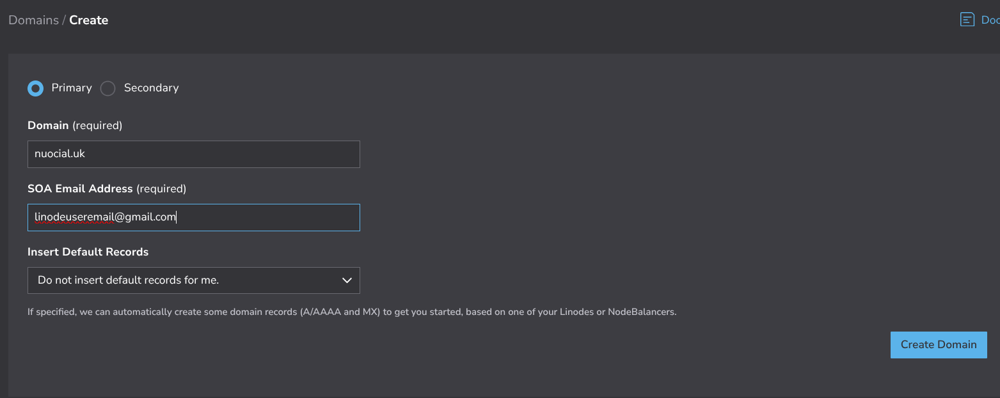 

and click "Create Domain". Your DNS system should then be all set. 

### Step 8 - VPC

Now you need to setup your VPC. I'll just show you the images of mine
MAKE SURE YOUR SUBNET RANGE IS **10.0.1.0/24** and THE VPC NAME is **adt-vpc** and is in the **gb-lon** region  

The whole (adt-vpc) setup

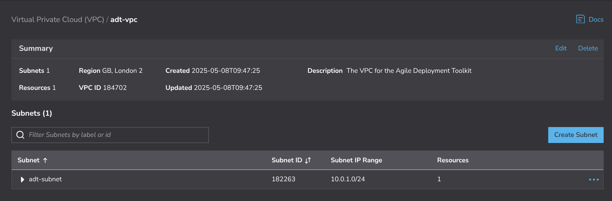 

And the subnet:  

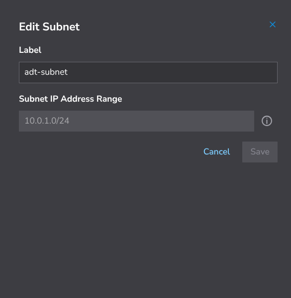 

### Step 9 - FIREWALL

And now the firewall:  

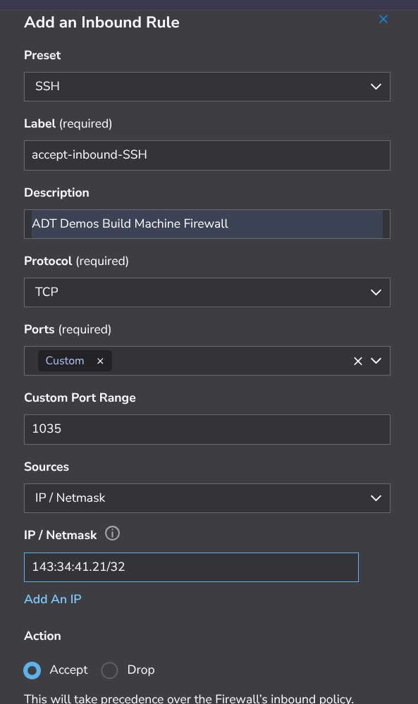 

What it looks like (remember to hit the save button)  

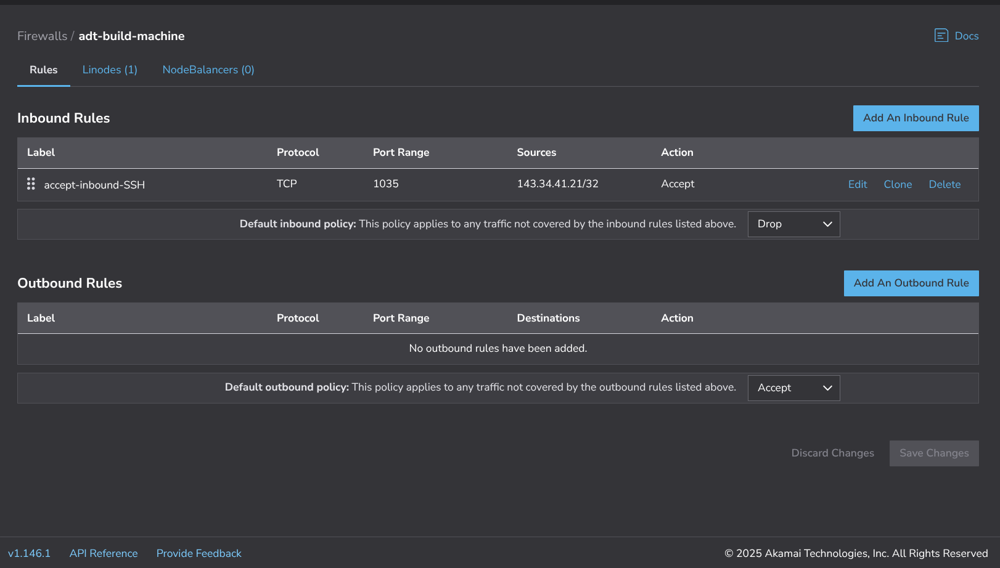 

So using your values from your **~/adt-credentials.dat** file you can populate your Stackscript which will then look similar to:

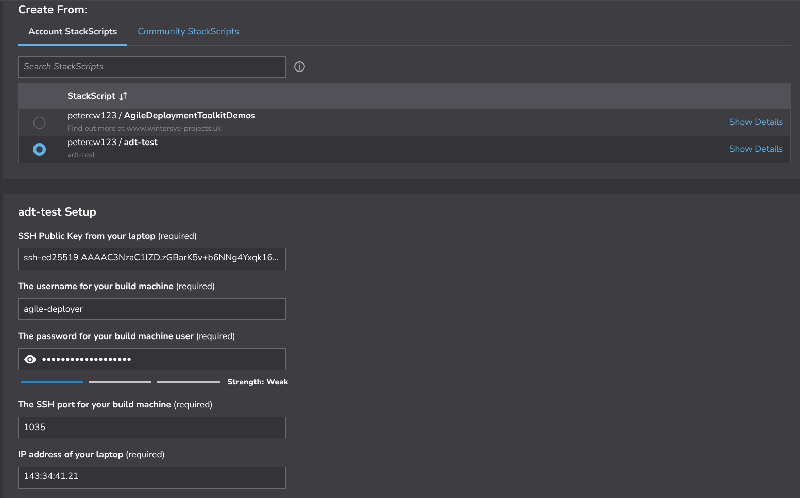  
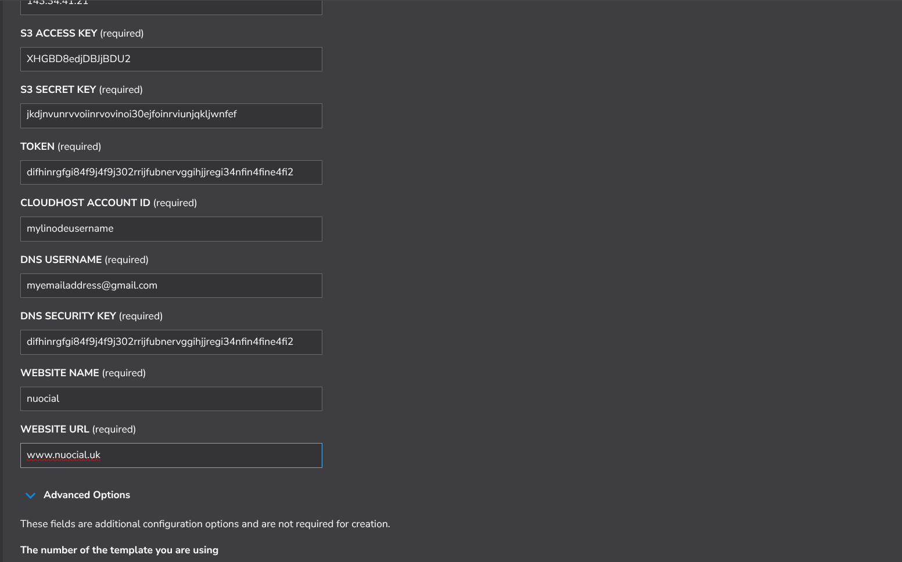  

And now setup the rest of your linode and click **CREATE LINODE** the process of which should look like these images

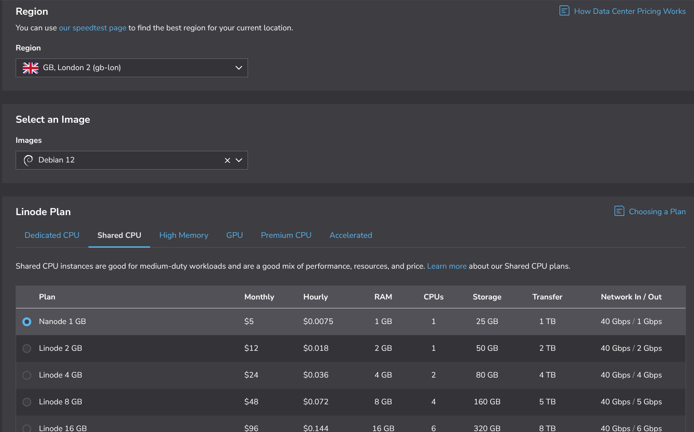  
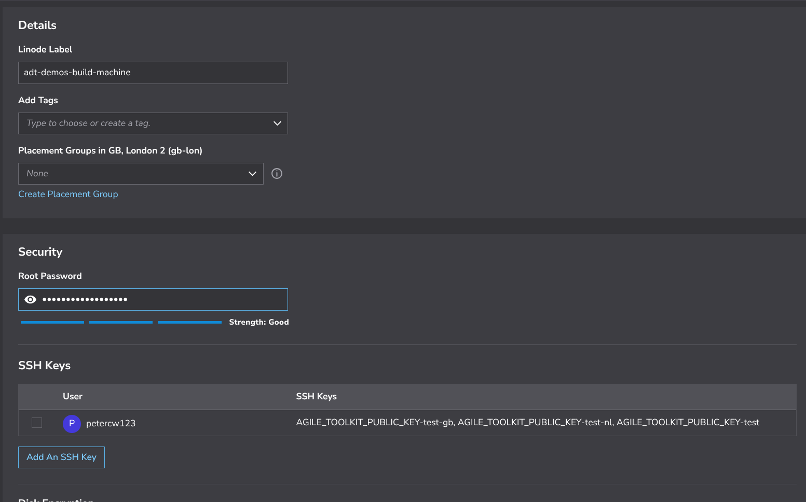 
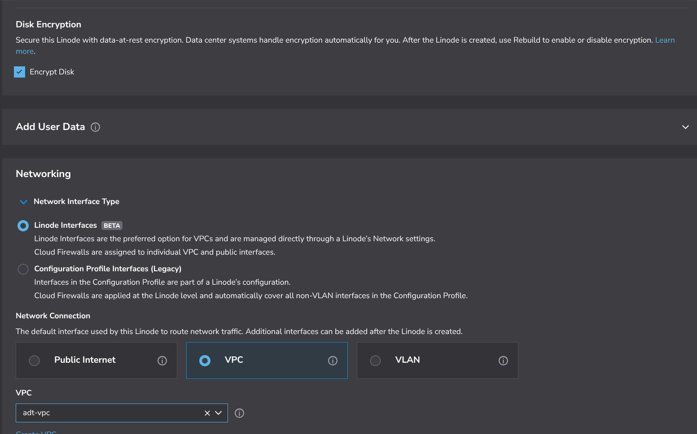 
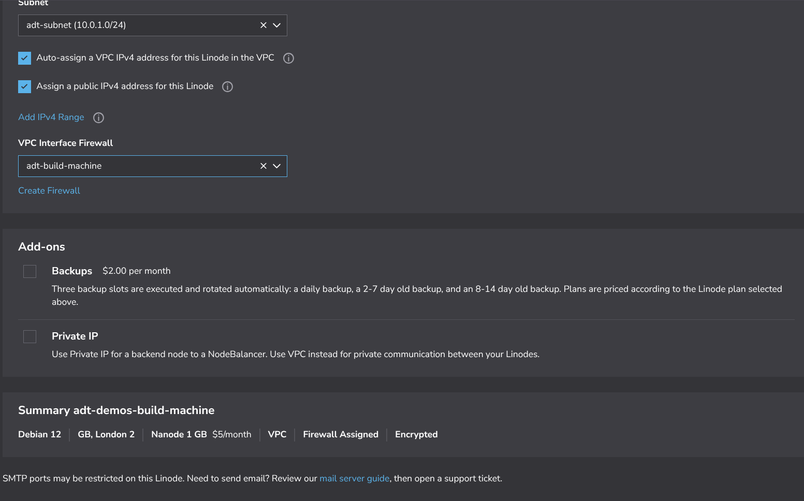 

The build will then run and you can check the ssh onto the machine using the username you gave and password to do a sudo and check the logs to see how the build is progressing and if there are any problems. 

