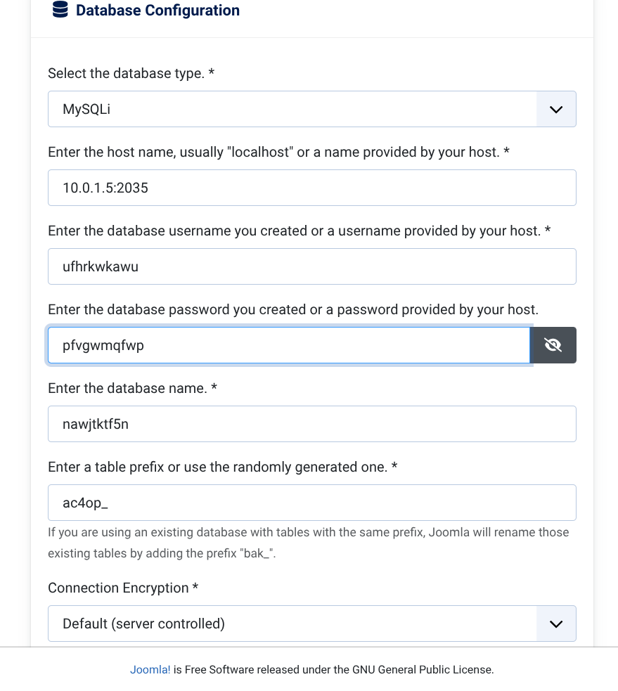
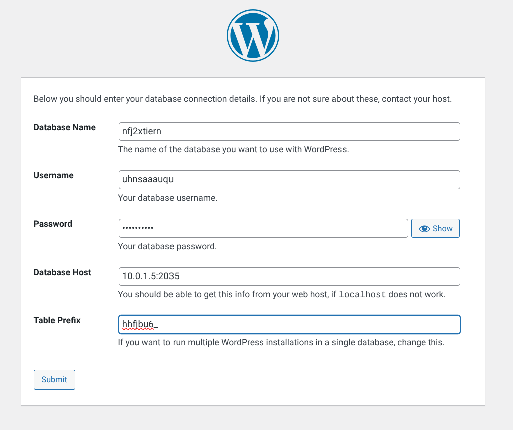
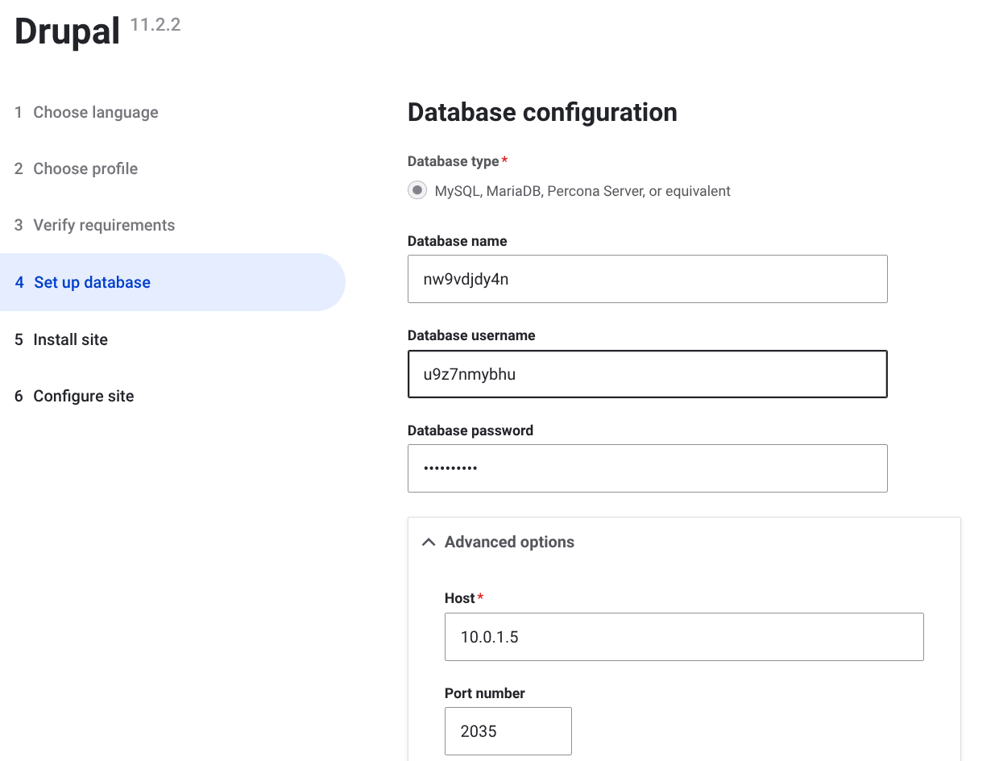
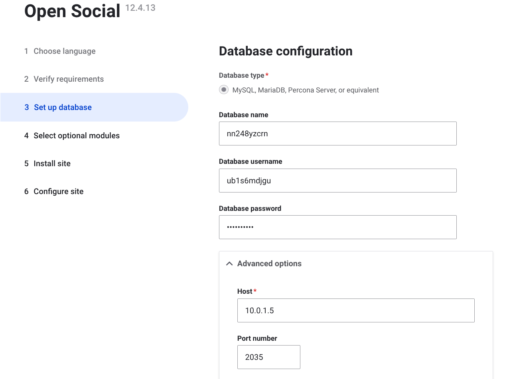
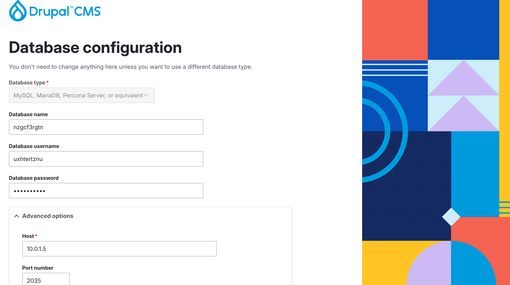
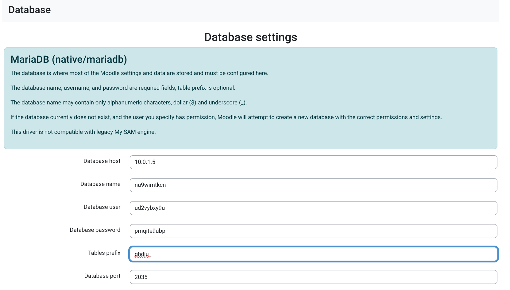

### MANDATORY PRE-REQUISITE STEPS NEEDED BY ALL DEMOS BELOW

Perform step 1 or 2 below according to your experience and apply the overrides to your StackScript as described below for your desired demo type before you click "Create Linode"

1. If you are a beginner, follow [here](./QuickStartDemosPrepBeginnerLevel.md)  
2. If you are an expert, follow [here](./QuickStartDemosPrepExpertLevel.md)

-------------------------
### QUICK DEMO OVERRIDE EXAMPLES

### Demo 1 (StackScript overrides for a virgin installation of the Joomla CMS)  

>     set "The number (1, 2 or 3) of the template you are using" to "1"  
>     set "WEBSITE DISPLAY NAME" to "My Joomla Demo"  
>     set "APPLICATION" to "joomla"  
>     set "APPLICATION IDENTIFIER" to "1"  
>     set "JOOMLA VERSION" and set it to the latest version of Joomla for example, "5.1.2"  
>     set "BUILD ARCHIVE CHOICE" to "virgin"  
>     set "BASELINE DB REPOSITORY" to "VIRGIN"  
>     set "APPLICATION BASELINE SOURCECODE REPOSITORY" to "JOOMLA:5.1.2"  

----------------------

To find what to set your application credentials to ssh onto your new build machine sudo to root and cat the application_credentials.dat file that the build generated as shown below

>     ssh -p <build-machine-port> <username>@<build-machine-ip>
>     sudo su
>          <password>
>     /bin/cat /home/<username>/adt-build-machine-scripts/runtimedata/linode/<build-identifier>/credentials/application_credentials.dat

which in my case looks like:

>     ssh -p 1035 agile-deployer@156.23.43.21
>     /bin/cat /home/agile-deployer/adt-build-machine-scripts/runtimedata/linode/test-build/credentials/application_credentials.dat

Go to the URL of your virgin Joomla installation in my case:

>     https://www.nuocial.uk

and complete the installation of Joomla. When you are putting the credentials you got from application_credentials.dat from your build machine the installation process should look similar to:

 

**IMPORTANT:**

You will be prompted to remove the file beginning /var/www/html/installation/_J.... The Agile Deployment Toolkit will do that for your automatically all you need to do when prompted to remove the /var/www/html/installation/_J.... file is to click through a second time (at the bottom of the page prompting you to action) and you will be able to progress without doing anything. 

---------------------------

### Demo 2 (StackScript overrides for a virgin installation of the Wordpress CMS)   

>     set "The number (1, 2 or 3) of the template you are using" to "1"  
>     set "WEBSITE DISPLAY NAME" to "My Wordpress Demo"  
>     set "APPLICATION" to "wordpress"  
>     set "APPLICATION IDENTIFIER" to "2"  
>     set "BUILD ARCHIVE CHOICE" to "virgin"  
>     set "BASELINE DB REPOSITORY" to "VIRGIN"  
>     set "APPLICATION BASELINE SOURCECODE REPOSITORY" to "WORDPRESS"

----------------------

To find what to set your application credentials to ssh onto your new build machine sudo to root and cat the application_credentials.dat file that the build generated as shown below

>     ssh -p <build-machine-port> <username>@<build-machine-ip>
>     sudo su
>          <password>
>     /bin/cat /home/<username>/adt-build-machine-scripts/runtimedata/linode/<build-identifier>/credentials/application_credentials.dat

which in my case looks like:

>     ssh -p 1035 agile-deployer@121.34.32.65
>     /bin/cat /home/agile-deployer/adt-build-machine-scripts/runtimedata/linode/test-build/credentials/application_credentials.dat

Go to the URL of your virgin Wordpress installation in my case:

>     https://www.nuocial.uk

and complete the installation of Wordpress. When you are putting the credentials you got from application_credentials.dat from your build machine the installation process should look similar to:

 

---------------------------

### Demo 3 (StackScript overrides for a virgin installation of Drupal, Drupal CMS or Drupal Opensocial) 

**DRUPAL (10.0.10)**  

>     set "The number (1, 2 or 3) of the template you are using" to "1"  
>     set "WEBSITE DISPLAY NAME" to "My Drupal Demo" 
>     set "APPLICATION" to "drupal"   
>     set "APPLICATION IDENTIFIER" to "3"  
>     set "DRUPAL VERSION" set it to the latest version of drupal for example, "10.0.10" 
>     set "BUILD ARCHIVE CHOICE" to "virgin"   
>     set "BASELINE DB REPOSITORY" to "VIRGIN"  
>     set "APPLICATION BASELINE SOURCECODE REPOSITORY" to "DRUPAL:10.0.10"
>

To find what to set your application credentials to ssh onto your new build machine sudo to root and cat the application_credentials.dat file that the build generated as shown below

>     ssh -p <build-machine-port> <username>@<build-machine-ip>
>     sudo su
>          <password>
>     /bin/cat /home/<username>/adt-build-machine-scripts/runtimedata/linode/<build-identifier>/credentials/application_credentials.dat

which in my case looks like:

>     ssh -p 1035 agile-deployer@121.34.32.65
>     /bin/cat /home/agile-deployer/adt-build-machine-scripts/runtimedata/linode/test-build/credentials/application_credentials.dat

Go to the URL of your virgin Wordpress installation in my case:

>     https://www.nuocial.uk

and complete the installation of Wordpress. When you are putting the credentials you got from application_credentials.dat from your build machine the installation process should look similar to:

  

------------------

**OPENSOCIAL**  

You can install [OPENSOCIAL](https://www.getopensocial.com/) by making the following alterations to the above DRUPAL (10.0.10) install method

>     set "The Display name for your website e.g. My Demo Website" to "My Opensocial Demo"  
>     set "APPLICATION BASELINE SOURCECODE REPOSITORY" to "DRUPAL:social"

To find what to set your application credentials to ssh onto your new build machine sudo to root and cat the application_credentials.dat file that the build generated as shown below

>     ssh -p <build-machine-port> <username>@<build-machine-ip>
>     sudo su
>          <password>
>     /bin/cat /home/<username>/adt-build-machine-scripts/runtimedata/linode/<build-identifier>/credentials/application_credentials.dat

which in my case looks like:

>     ssh -p 1035 agile-deployer@102.12.32.12
>     /bin/cat /home/agile-deployer/adt-build-machine-scripts/runtimedata/linode/test-build/credentials/application_credentials.dat

Go to the URL of your virgin Wordpress installation in my case:

>     https://www.nuocial.uk

and complete the installation of Wordpress. When you are putting the credentials you got from application_credentials.dat from your build machine the installation process should look similar to:

 

----------------------

**DRUPAL CMS**  

You can install [DRUPAL CMS](https://new.drupal.org/drupal-cms) by making the following alterations to the above DRUPAL (10.0.10) install method  

You can install  by making the modification to the steps above:

>     set "The Display name for your website e.g. My Demo Website" to "My Druapl CMS Demo"  
>     set "APPLICATION BASELINE SOURCECODE REPOSITORY" to "DRUPAL:cms"

To find what to set your application credentials to ssh onto your new build machine sudo to root and cat the application_credentials.dat file that the build generated as shown below

>     ssh -p <build-machine-port> <username>@<build-machine-ip>
>     sudo su
>          <password>
>     /bin/cat /home/<username>/adt-build-machine-scripts/runtimedata/linode/<build-identifier>/credentials/application_credentials.dat

which in my case looks like:

>     ssh -p 1035 agile-deployer@102.12.32.12
>     /bin/cat /home/agile-deployer/adt-build-machine-scripts/runtimedata/linode/test-build/credentials/application_credentials.dat

Go to the URL of your virgin Wordpress installation in my case:

>     https://www.nuocial.uk

and complete the installation of Drupal. When you are putting the credentials you got from application_credentials.dat from your build machine the installation process should look similar to:

  

---------------------------

### Demo 4 (StackScript overrides for a virgin installation of the Moodle CMS)  

>     set "The number (1, 2 or 3) of the template you are using" to "1"  
>     set "WEBSITE DISPLAY NAME" to "My Moodle Demo"  
>     set "APPLICATION" to "moodle"  
>     set "APPLICATION IDENTIFIER" to "4"  
>     set "BUILD ARCHIVE CHOICE" to "virgin"  
>     set "BASELINE DB REPOSITORY" to "VIRGIN"  
>     set "APPLICATION BASELINE SOURCECODE REPOSITORY" to "MOODLE"   

----------------------

To find what to set your application credentials to ssh onto your new build machine sudo to root and cat the application_credentials.dat file that the build generated as shown below

>     ssh -p <build-machine-port> <username>@<build-machine-ip>
>     sudo su
>          <password>
>     /bin/cat /home/<username>/adt-build-machine-scripts/runtimedata/linode/<build-identifier>/credentials/application_credentials.dat

which in my case looks like:

>     ssh -p 1035 agile-deployer@78.98.32.19
>     /bin/cat /home/agile-deployer/adt-build-machine-scripts/runtimedata/linode/test-build/credentials/application_credentials.dat

Go to the URL of your virgin Moodle installation in my case:

>     https://www.nuocial.uk

and complete the installation of Wordpress. When you are putting the credentials you got from application_credentials.dat from your build machine the installation process should look similar to:

  

---------------------------

### Demo 5 (StackScript overrides for a virgin installation of the Joomla CMS from a baselined repository)  

This is just a sample virgin joomla install there's no sample data or anything it just shows you how you could baseline a virgin joomla installation for maximum ease when making repeated virgin CMS deployments. The advantage to creating a baseline of a virgin installation of a CMS is that you don't have to enter any parameters into the application GUI because the system deals with it all for you and so you can make faster deployments once you have a baseline to build from. The disadvantage is that you have to update the installed CMS from the administrator backend to the latest version because the baseline you made some weeks/months ago will be several releases back from current.

1. Once the application is installed, the username is "webmaster" and the password is "mnbcxz098321QQZZ"

>     set "The number (1, 2 or 3) of the template you are using" to "2"  
>     set "The Display name for your website e.g. My Demo Website" to "My Vanilla Joomla Installation"  
>     set "APPLICATION" to "joomla"  
>     set "APPLICATION IDENTIFIER" to "1"  
>     set "BASELINE DB REPOSITORY" to "joomla5.2.5-db-baseline" 
>     set "APPLICATION BASELINE SOURCECODE REPOSITORY" to "joomla5.2.5-webroot-sourcecode-baseline"

Wait for the application install to have been completed and available at:

>      https://<dns-url>

-----------------

### Demo 6 (StackScript overrides for a virgin installation of the Wordpress CMS from a baselined repository)  

This is a sample virgin wordpress installation from baselined repositories.  

1. Once the application is installed, the username is "webmaster" and the password is "mnbcxz098321QQZZ"

>     set "The number (1, 2 or 3) of the template you are using" to "2"  
>     set "The Display name for your website e.g. My Demo Website" to "My Vanilla Wordpress Installation"  
>     set "APPLICATION" to "wordpress"  
>     set "APPLICATION IDENTIFIER" to "2"  
>     set "BASELINE DB REPOSITORY" to "wordpress6.8.2-db-baseline" 
>     set "APPLICATION BASELINE SOURCECODE REPOSITORY" to "wordpress6.8.2-webroot-sourcecode-baseline"

Wait for the application install to have been completed and available at:

>      https://<dns-url>

-----------------

### Demo 7 (StackScript overrides for a virgin installation of the Drupal CMS from a baselined repository)  

This is a sample virgin drupal installation from baselined repositories.  

1. Once the application is installed, the username is "webmaster" and the password is "mnbcxz098321QQQZZZ"

>     set "The number (1, 2 or 3) of the template you are using" to "2"  
>     set "The Display name for your website e.g. My Demo Website" to "My Vanilla Drupal Installation"  
>     set "APPLICATION" to "drupal"  
>     set "APPLICATION IDENTIFIER" to "3"  
>     set "BASELINE DB REPOSITORY" to "drupal11.1.7-db-baseline" 
>     set "APPLICATION BASELINE SOURCECODE REPOSITORY" to "drupal11.1.7-webroot-sourcecode-baseline"

Wait for the application install to have been completed and available at:

>      https://<dns-url>

-----------------

### Demo 8 (StackScript overrides for a virgin installation of the Moodle CMS from a baselined repository) 

This is a sample virgin moodle installation from baselined repositories.  

1. Once the application is installed, the username is "webmaster" and the password is "mnbcxz098321QQQZZZ$$"

>     set "The number (1, 2 or 3) of the template you are using" to "2"  
>     set "The Display name for your website e.g. My Demo Website" to "My Vanilla Moodle Installation"  
>     set "APPLICATION" to "moodle"  
>     set "APPLICATION IDENTIFIER" to "4"  
>     set "BASELINE DB REPOSITORY" to "moodle5.0-db-baseline" 
>     set "APPLICATION BASELINE SOURCECODE REPOSITORY" to "moodle5.0-webroot-sourcecode-baseline"

Wait for the application install to have been completed and available at:

>      https://<dns-url>
