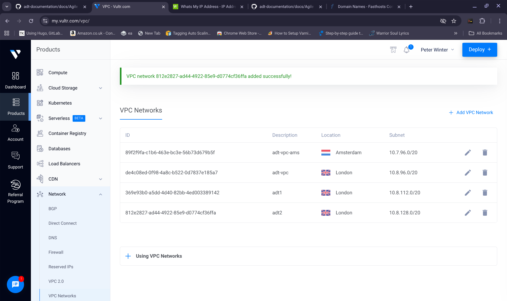

For reference the VPC IP RANGES that I used for my sample deployments are shown below. 
The ranges that you need to set may vary depending on the region that you deploying to. 
You should check in the GUI system with your provider that you are using the correct range for your region.

>     Digital Ocean: export VPC_IP_RANGE="10.106.16.0/20"
>     VPC_IP_RANGES for different regions: AMS2	10.14.16.0/20 | AMS3	10.18.16.0/20 | ATL1	10.50.16.0/20 | BLR1	10.47.16.0/20 | FRA1	10.19.16.0/20 | LON1	10.16.16.0/20 | NYC1	10.10.16.0/20 | NYC2	10.13.16.0/20 | NYC3 10.17.16.0/20 | SFO1	10.12.16.0/20 | SFO2 10.46.16.0/20 | SFO3	10.48.16.0/20 | SGP1 10.15.16.0/20 | SYD1 10.49.16.0/20 | TOR1	10.29.16.0/20
> 
>     Exoscale: export VPC_IP_RANGE="10.0.0.0/24"
> 
>     Linode: export VPC_IP_RANGE="10.0.1.0/24"
> 
>     Vultr: export VPC_IP_RANGE="10.8.96.0/20"
>     VPC_IP_RANGES for different regions: Amsterdam 10.7.96.0/20 | Paris 10.24.96.0/20 | Frankfurt 10.9.96.0/20 | London 10.8.96.0/20 |Madrid 10.29.96.0/20 | Manchester 10.56.96.0/20 | Stockholm 10.41.96.0/20 | Warsaw 10.27.96.0/20 | Atlanta 10.6.96.0/20 | New York 10.1.96.0/20 | Chicago 10.2.96.0/20 | Dallas 10.3.96.0/20 | Honolulu 10.45.96.0/20 | Los Angeles 10.5.96.0/20 | Mexico City 10.42.96.0/20 | Miami 10.39.96.0/20 | Seattle  10.4.96.0/20 | Silicon Valley 10.12.96.0/20 | Toronto 10.22.96.0/20 | Tokyo 10.25.96.0/20 | Bangalore 10.51.96.0/20 | Delhi 10.52.96.0/20 | Mumbai 10.46.96.0/20 | Osaka 10.55.96.0/20 | Seoul 10.34.96.0/20 | Singapore 10.40.96.0/20 | Tel Aviv 10.50.96.0/20 | Melbourne 10.44.96.0/20 | Sydney 10.19.96.0/20 | Johannesburg 10.49.96.0/20 | Santiago 10.53.96.0/20 | Sao Paulo  10.43.96.0/20

The following image shows the page you should doube check the IP range for the particular VPC you are using when deploying with vultr

