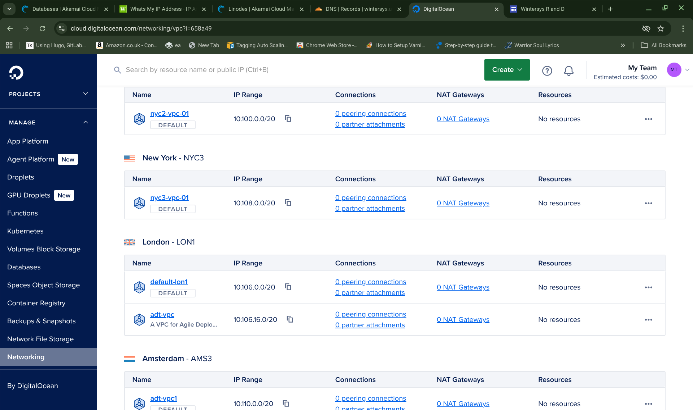
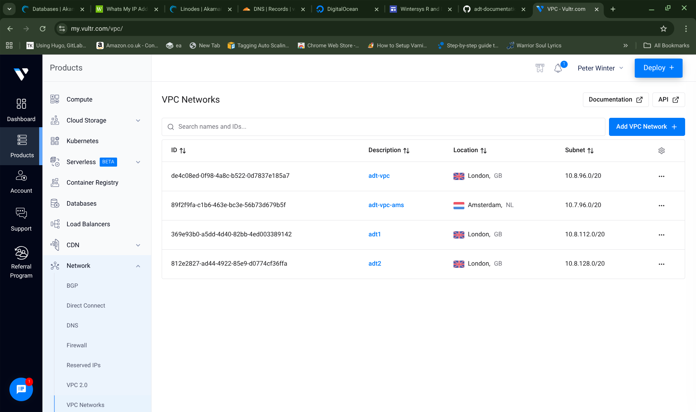

For reference the VPC IP RANGES that I used for my sample deployments are shown below. 
The ranges that you need to set may vary depending on the region that you deploying to. 
You should check in the GUI system with your provider that you are using the correct range for your region.

### Digital Ocean: 
 
I am deploying to the lon1 region and my vpc is called "adt-vpc". So, I need to go to the "networking" menu in the gui system and then click VPC and that will list all my currently active VPC networks as shown in the following image:

**If I look for my region (LON1) and my VPC name "adt-vpc" I can see that the VPC IP RANGE that I need is: 10.106.16.0/20**  
Which means my template will need to be set as below

>     export VPC_IP_RANGE="10.106.16.0/20"

### Exoscale: 

I set my template as: 

>     export VPC_IP_RANGE="10.0.0.0/24"

### Linode: 

I set my template as: 

>     export VPC_IP_RANGE="10.0.1.0/24"

### Vultr:

I am deploying to the London region and my vpc is called "adt-vpc". So, I need to go to the "network" menu in the gui system and then click "VPC Networks" and that will list all my currently active VPC networks as shown in the following image:

**If I look for my region (LHR) and my VPC name "adt-vpc" I can see that the VPC IP RANGE that I need is: 10.8.96.0/20**  
Which means my template will need to be set as below

>     export VPC_IP_RANGE="10.8.96.0/20"

