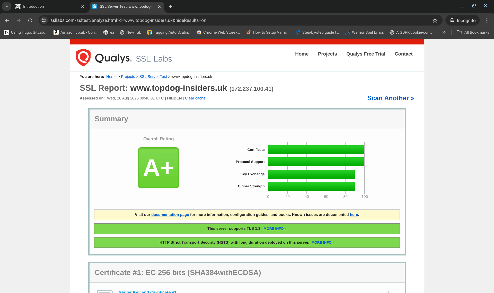
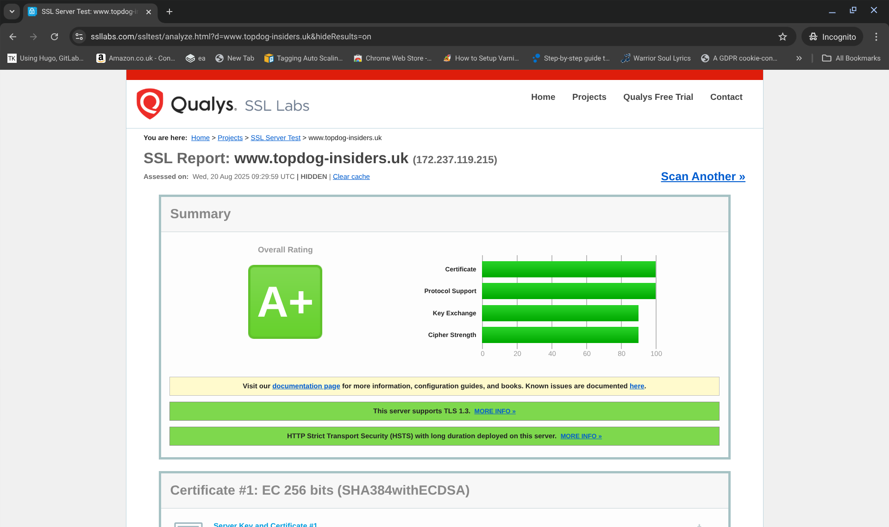

You are welcome to alter the configurations of the webserver that you deploy. You will find the files to do that under

${HOME}/providerscripts/webserver  

and you can just change the configuration files for your webserver of choice to have it deploy according to your taste. 
You can also have separate confguration sets if you want to deploy different solutions for different operational needs. 
Anyway, I developed this toolkit with a default set of configurations which may or may not fit with what you want.
I tested the configurations I provided for rudimentary security validation using my default configurations and these are the results that I got.

APACHE:  

NGINX:  

LIGHTTPD:  

