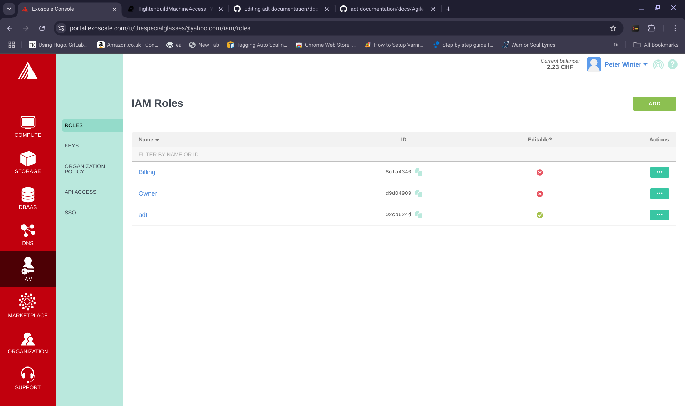
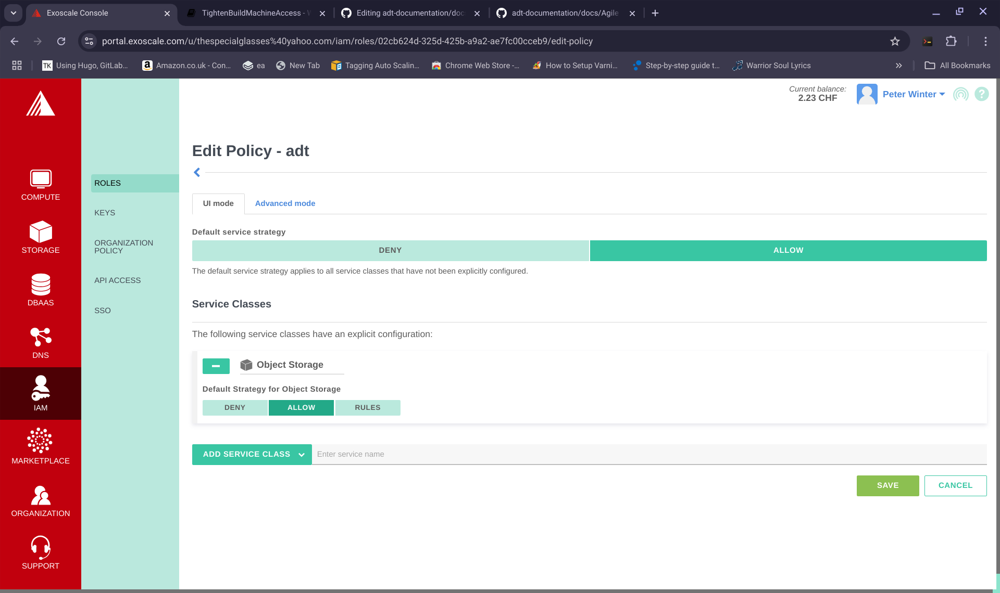

**PREBUILD NECESSITIES**

If you don't already have a build machine running in the Exoscale cloud, follow these steps to get ready for the main build)

1. Begin by following this: [Build Machine Setup](./buildmachine.md)

Following the steps in 1. will give you a build machine with access through the firewall for one machine (the laptop IP address that you provided).

-----------------------------

**EXPEDITED BUILD PROCESS**

This will deploy the latest version of Joomla using template 1 which you can read about here: [template 1](https://github.com/wintersys-projects/adt-build-machine-scripts/blob/main/templatedconfigurations/templates/exoscale/exoscale1.description) and the expedited method.

If you have followed these steps your build machine is online and secured and you have an SSH session open to it from your laptop through which to initiate your build processes.

We need several pieces of information from our cloud host and 3rd party services for a successful build to be possible:

I am going to use the example of joomla to build from and so this example will build a virgin installation of the latest version of joomla

---------------------------------------

To find the latest version of Joomla, I go to this URL in my browser:

[Joomla Latest](https://downloads.joomla.org/)

And I note the latest version in a separate text file:

>     joomla_version="4.0.4"  

You can of course use a legacy version of joomla also by choosing a different version numnber. 

-------------------------------------

I then need a set of compute access keys so, I go to the IAM option on my exoscale dashboard and generate an IAM key with compute access. In my separate text file, I record:

>     exoscale_access_key_compute="XXXXX"  where XXXXX and YYYYY are the actual values generated when I click "Add Key"
>     exoscale_secret_key_compute="YYYYY"

I then need a set of Object Storage (S3) access keys so, I go to the IAM option on my exoscale dashboard and generate an IAM key with S3 access. In my separate text file, I record:

>     exoscale_access_key_s3="AAAAA"  where AAAAA and BBBBB are the actual values generated when I click "Add Key"
>     exoscale_secret_key_s3="BBBBB"

I then need a set of DNS access keys so, I go to the IAM option on my exoscale dashboard and generate an IAM key with DNS access. 

In my separate text file, I record:

>     exoscale_access_key_dns="CCCCC"  where CCCCC and DDDDD are the actual values generated when I click "Add Key"
>     exoscale_secret_key_dns="DDDDD"

**NOTE:** Alternatively you could generate one set of IAM keys and give that one set all three permissions, Compute, DNS and S3. You wouldn't have to juggle three set of keys then and could use the same key pair in all three cases.

-----------------------------------

You now need to make a note of the email address that you have registered with your exoscale account:

>     exoscale_email="testemail@testemail.com"

-----------------------------------

You then need the url that you want to use for your website. If you don't have a DNS URL for your website, you need to purchase one and set the nameservers to exoscale as described [here](../Deployment/Nameservers.md)

>     exoscale_dns_name="www.testdeploy.com"

-------------------------------

You then need the username and owner of you git provider application repositories.
To do this, if you don't have a git account sign up with one (in this case using github, but, you have the choice of bitbucket and gitlab as well) and record the username that you sign up with:

>     gitusername="mygithubuser"

Then create a "personal access token" by following: 

[Personal Access Token](https://docs.github.com/en/authentication/keeping-your-account-and-data-secure/creating-a-personal-access-token) making sure you give it all "repo" permissions as well as the "delete repository" permission

>     gitpersonalaccesstoken="KKKKK" where KKKKK represents your actual personal access token

--------------------------------

To keep this as simple as possible, I have missed out the SMTP credentials, but, you can find out more about them [here](../../../doco/AgileToolkitDeployment/DeployingSMTPService.md). If you wish to include SMTP credentials you will need to have a service offering set up with either sendpulse, mailjet or AWS SES.

So, that should be all the core credentials that I need to make a deployment. I can save my text file now (and keep it secure) because I might want to use these credentials again for other deployments or redeployments. 

--------------------------------------------
--------------------------------------------

So, at the command line of my build machine that we spun up earlier:

My chosen username is "wintersys-projects"

So, to begin an expedited build process, I need to:

>     cd /home/wintersys-projects/adt-build-machine-scripts/templatedconfigurations/templates/exoscale

Then we can open up the 

>     vi exoscale1.tmpl

This file looks like this (I have put a dashes before each line I wish to modify for this deployment which is for illustrative purposes only):

>     ###############################################################################################
>     # Refer to: ${BUILD_HOME}/templatedconfigurations/specification.md
>     ###############################################################################################
>     #This template is configured for virgin style builds
>     
>     #####MANDATORY - Bare minimum set of values that you must provide for a build to have any chance of succeeding
>     #####NOT REQUIRED - isn't used by the Exoscale
>     
>     #####Application Settings#########
>     ------ export APPLICATION="" #MANDATORY 
>     ------ export APPLICATION_IDENTIFIER="" #MANDATORY
>     ------ export JOOMLA_VERSION="" #MANDATORY (depending on the above settings - a joomla deployment)
>     export DRUPAL_VERSION="" #MANDATORY (depending on the above settings - a drupal deployment)
>     ------ export APPLICATION_BASELINE_SOURCECODE_REPOSITORY="" #MANDATORY
>     export BASELINE_DB_REPOSITORY="VIRGIN"
>     export APPLICATION_LANGUAGE="PHP" 
>     export PHP_VERSION="8.3" 
>     export BUILD_ARCHIVE_CHOICE="virgin"
>     export BUILD_CHOICE="0"
>     export APPLICATION_NAME="Demo Application"
>     
>     
>     #####S3 Datastore Settings#######
>     ------ export S3_ACCESS_KEY=""  #MANDATORY
>     ------ export S3_SECRET_KEY=""  #MANDATORY
>     export S3_HOST_BASE="sos-ch-gva-2.exo.io" 
>     export S3_LOCATION="US" #For exoscale, this always needs to be set to "US"
>     export DATASTORE_CHOICE="exoscale"
>     export DIRECTORIES_TO_MOUNT="" #This should always be unset for a virgin and baseline deployments
>     export PERSIST_ASSETS_TO_CLOUD="0" #This should always be set to 0 for a virgin and baseline deployment
>     
>     #####OS Settings#########
>     export BUILDOS="debian" # One of ubuntu|debian
>     export BUILDOS_VERSION="12" # One of 20.04 22.04 24.04|10 11 12
>     
>     ######Cloudhost Provider Settings#######
>     export TOKEN="" #NOT REQUIRED
>     ------ export ACCESS_KEY=""   #MANDATORY
>     ------ export SECRET_KEY=""   #MANDATORY
>     ------ export CLOUDHOST_ACCOUNT_ID=""  #MANDATORY for Exoscale - this should be the account email address that you login to the portal with
>     
>     ######DNS Settings##########
>     ------ export DNS_USERNAME=""  #MANDATORY
>     ------ export DNS_SECURITY_KEY=""   #MANDATORY
>     export DNS_CHOICE="exoscale" #you will need to set your DNS nameservers according to this choice
>     
>     
>     #####Webserver Settings########
>     ------ export WEBSITE_DISPLAY_NAME="" #MANDATORY
>     ------ export WEBSITE_NAME="" #MANDATORY
>     ------ export WEBSITE_URL=""  #MANDATORY
>     export WEBSERVER_CHOICE="NGINX"
>     export NUMBER_WS="1"
>     
>     #####Git settings#####
>     export GIT_USER="Templated User" 
>     export GIT_EMAIL_ADDRESS="templateduser@dummyemailZ123.com" 
>     
>     #####Infrastructure Repository Settings#######
>     export INFRASTRUCTURE_REPOSITORY_PROVIDER="github"
>     export INFRASTRUCTURE_REPOSITORY_OWNER="wintersys-projects"
>     export INFRASTRUCTURE_REPOSITORY_USERNAME="wintersys-projects"
>     export INFRASTRUCTURE_REPOSITORY_PASSWORD="none"
>     
>     ###### Application Repository Settings########
>     export APPLICATION_REPOSITORY_PROVIDER="github" 
>     ------ export APPLICATION_REPOSITORY_OWNER="" #MANDATORY
>     ------ export APPLICATION_REPOSITORY_USERNAME="" #MANDATORY
>     ------ export APPLICATION_REPOSITORY_PASSWORD="" #MANDATORY
>     ------ export APPLICATION_REPOSITORY_TOKEN="" #MANDATORY
>     
>     ##### System Email Settings#########
>     export SYSTEM_EMAIL_PROVIDER="" 
>     export SYSTEM_TOEMAIL_ADDRESS="" 
>     export SYSTEM_FROMEMAIL_ADDRESS="" 
>     export SYSTEM_EMAIL_USERNAME="" 
>     export SYSTEM_EMAIL_PASSWORD="" 
>     export EMAIL_NOTIFICATION_LEVEL="ERROR"
>     
>     ##### Database Settings######
>     export DB_PORT="2035"
>     export DATABASE_INSTALLATION_TYPE="Maria"
>     export DATABASE_DBaaS_INSTALLATION_TYPE=""
>     export BYPASS_DB_LAYER="0"
>     
>     #####Server Settings #######
>     export REGION="ch-gva-2"
>     export DB_SERVER_TYPE="tiny"
>     export WS_SERVER_TYPE="tiny"
>     export AS_SERVER_TYPE="tiny"
>     export AUTH_SERVER_TYPE="tiny"
>     export CLOUDHOST="exoscale"
>     export MACHINE_TYPE="EXOSCALE"
>     export SSH_PORT="1035"
>     export SERVER_TIMEZONE_CONTINENT="Europe"
>     export SERVER_TIMEZONE_CITY="London"
>     export USER="root"
>     export AUTHENTICATION_SERVER="0"
>     
>     #####Build Settings######
>     export PRODUCTION="0"
>     export DEVELOPMENT="1"
>     ------ export BUILD_IDENTIFIER="" #MANDATORY
>     export NO_AUTOSCALERS="0"
>     
>     #####Security Settings#####
>     export ACTIVE_FIREWALLS="3"
>     export PUBLIC_KEY_NAME="AGILE_TOOLKIT_PUBLIC_KEY"
>     export SSL_GENERATION_METHOD="AUTOMATIC"
>     export SSL_GENERATION_SERVICE="LETSENCRYPT"
>     export SSL_LIVE_CERT="1"
>     export ALGORITHM="rsa"
>     export BUILD_MACHINE_VPC="1"
>     export VPC_IP_RANGE="10.0.0.0/24"
>
>     #####Build Style#####
>     export INPARALLEL="0"

So, I have referred to the specification and obtained necessary credentials from my accounts (Exoscale/Github) and decide how I want to configure the template 

So, editing /home/wintersys-projects/adt-build-machine-scripts/templatedconfigurations/templates/exoscale/exoscale1.tmpl and using the values I recorded in my text file earlier, I modify the file as follows, the lines beginning with dashes have been modified

>     ###############################################################################################
>     # Refer to: ${BUILD_HOME}/templatedconfigurations/specification.md
>     ###############################################################################################
>     #This template is configured for virgin style builds
>     
>     #####MANDATORY - Bare minimum set of values that you must provide for a build to have any chance of succeeding
>     #####NOT REQUIRED - isn't used by the Exoscale
>     
>     #####Application Settings#########
>     ------ export APPLICATION="joomla" #MANDATORY 
>     ------ export APPLICATION_IDENTIFIER="1" #MANDATORY
>     ------ export JOOMLA_VERSION="4.0.4" #MANDATORY (depending on the above settings - a joomla deployment)
>     export DRUPAL_VERSION="" #MANDATORY (depending on the above settings - a drupal deployment)
>     ------ export APPLICATION_BASELINE_SOURCECODE_REPOSITORY="JOOMLA:4.0.4" #MANDATORY
>     export BASELINE_DB_REPOSITORY="VIRGIN"
>     export APPLICATION_LANGUAGE="PHP" 
>     export PHP_VERSION="8.3" 
>     export BUILD_ARCHIVE_CHOICE="virgin"
>     export BUILD_CHOICE="0"
>     export APPLICATION_NAME="Demo Application"
>     
>     
>     #####S3 Datastore Settings#######
>     ------ export S3_ACCESS_KEY="AAAAA"  #MANDATORY
>     ------ export S3_SECRET_KEY="BBBBB"  #MANDATORY
>     export S3_HOST_BASE="sos-ch-gva-2.exo.io" 
>     export S3_LOCATION="US" #For exoscale, this always needs to be set to "US"
>     export DATASTORE_CHOICE="exoscale"
>     export DIRECTORIES_TO_MOUNT="" #This should always be unset for a virgin and baseline deployments
>     export PERSIST_ASSETS_TO_CLOUD="0" #This should always be set to 0 for a virgin and baseline deployment
>     
>     #####OS Settings#########
>     export BUILDOS="debian" # One of ubuntu|debian
>     export BUILDOS_VERSION="12" # One of 20.04 22.04 24.04|10 11 12
>     
>     ######Cloudhost Provider Settings#######
>     export TOKEN="" #NOT REQUIRED
>     ------ export ACCESS_KEY="XXXXX"   #MANDATORY
>     ------ export SECRET_KEY="YYYYY"   #MANDATORY
>     ------ export CLOUDHOST_ACCOUNT_ID="testemail@testemail.com"  #MANDATORY for Exoscale - this should be the account email address that you login to the portal with
>     
>     ######DNS Settings##########
>     ------ export DNS_USERNAME="testemail@testemail.com"  #MANDATORY
>     ------ export DNS_SECURITY_KEY="CCCCC:DDDDD"   #MANDATORY
>     export DNS_CHOICE="exoscale" #you will need to set your DNS nameservers according to this choice
>     
>     
>     #####Webserver Settings########
>     ------ export WEBSITE_DISPLAY_NAME="Test Joomla Install" #MANDATORY
>     ------ export WEBSITE_NAME="testdeploy" #MANDATORY
>     ------ export WEBSITE_URL="www.testdeploy.com"  #MANDATORY
>     export WEBSERVER_CHOICE="NGINX"
>     export NUMBER_WS="1"
>     
>     #####Git settings#####
>     export GIT_USER="Templated User" 
>     export GIT_EMAIL_ADDRESS="templateduser@dummyemailZ123.com" 
>     
>     #####Infrastructure Repository Settings#######
>     export INFRASTRUCTURE_REPOSITORY_PROVIDER="github"
>     export INFRASTRUCTURE_REPOSITORY_OWNER="wintersys-projects"
>     export INFRASTRUCTURE_REPOSITORY_USERNAME="wintersys-projects"
>     export INFRASTRUCTURE_REPOSITORY_PASSWORD="none"
>     
>     ###### Application Repository Settings########
>     export APPLICATION_REPOSITORY_PROVIDER="github" 
>     ------ export APPLICATION_REPOSITORY_OWNER="mygithubuser" #MANDATORY
>     ------ export APPLICATION_REPOSITORY_USERNAME="mygithubuser" #MANDATORY
>     ------ export APPLICATION_REPOSITORY_PASSWORD="KKKKK" #MANDATORY
>     ------ export APPLICATION_REPOSITORY_TOKEN="KKKKK" #MANDATORY
>     
>     ##### System Email Settings#########
>     export SYSTEM_EMAIL_PROVIDER="" 
>     export SYSTEM_TOEMAIL_ADDRESS="" 
>     export SYSTEM_FROMEMAIL_ADDRESS="" 
>     export SYSTEM_EMAIL_USERNAME="" 
>     export SYSTEM_EMAIL_PASSWORD="" 
>     export EMAIL_NOTIFICATION_LEVEL="ERROR"
>     
>     ##### Database Settings######
>     export DB_PORT="2035"
>     export DATABASE_INSTALLATION_TYPE="Maria"
>     export DATABASE_DBaaS_INSTALLATION_TYPE=""
>     export BYPASS_DB_LAYER="0"
>     
>     #####Server Settings #######
>     export REGION="ch-gva-2"
>     export DB_SERVER_TYPE="tiny"
>     export WS_SERVER_TYPE="tiny"
>     export AS_SERVER_TYPE="tiny"
>     export AUTH_SERVER_TYPE="tiny"
>     export CLOUDHOST="exoscale"
>     export MACHINE_TYPE="EXOSCALE"
>     export SSH_PORT="1035"
>     export SERVER_TIMEZONE_CONTINENT="Europe"
>     export SERVER_TIMEZONE_CITY="London"
>     export USER="root"
>     export AUTHENTICATION_SERVER="0"
>     
>     #####Build Settings######
>     export PRODUCTION="0"
>     export DEVELOPMENT="1"
>     ------ export BUILD_IDENTIFIER="testdeploy" #MANDATORY
>     export NO_AUTOSCALERS="0"
>     
>     #####Security Settings#####
>     export ACTIVE_FIREWALLS="3"
>     export PUBLIC_KEY_NAME="AGILE_TOOLKIT_PUBLIC_KEY"
>     export SSL_GENERATION_METHOD="AUTOMATIC"
>     export SSL_GENERATION_SERVICE="LETSENCRYPT"
>     export SSL_LIVE_CERT="1"
>     export ALGORITHM="rsa"
>     export BUILD_MACHINE_VPC="1"
>     export VPC_IP_RANGE="10.0.0.0/24"
>
>     #####Build Style#####
>     export INPARALLEL="0"

If all the dashes I have added are removed, then this file (with live values and not symbolic ones) would be ready for deployment.

>     ${BUILD_HOME}/ExpeditedAgileDeploymentToolkit.sh

-----------------------------

You should now be at a point where your build machine is running and configured ready to deploy Joomla in a virgin (or uncustomised) configuration. 

---------------------------

Assuming that you have your Joomla application online now after following that video, what I would do if I wanted to build a Wordpress, Moodle or Drupal installation would be to follow the same procedure with the same template, but, minimally change the template as follows:

**For Wordpress:**

>     export APPLICATION="wordpress"
>     export APPLICATION_BASELINE_SOURCECODE_REPOSITORY="WORDPRESS" #MANDATORY 
>     export APPLICATION_IDENTIFIER="2"
>     export DATABASE_INSTALLATION_TYPE="MySQL" #I don't support Wordpress using Postgres

**For Drupal:**

>     export APPLICATION="drupal"
>     export DRUPAL_VERSION="9.2.6" 
>     export APPLICATION_BASELINE_SOURCECODE_REPOSITORY="DRUPAL:9.2.6" #MANDATORY 
>     export APPLICATION_IDENTIFIER="3"

**For Moodle:**

>     export APPLICATION="moodle"
>     export APPLICATION_BASELINE_SOURCECODE_REPOSITORY="MOODLE" #MANDATORY 
>     export APPLICATION_IDENTIFIER="4"

So, you have a template now that you can use over and over again for deploying different installations of these CMS systems. You can study the spec and learn how to modify the template in order to change machine sizes, regions, PHP settings and so on. 
