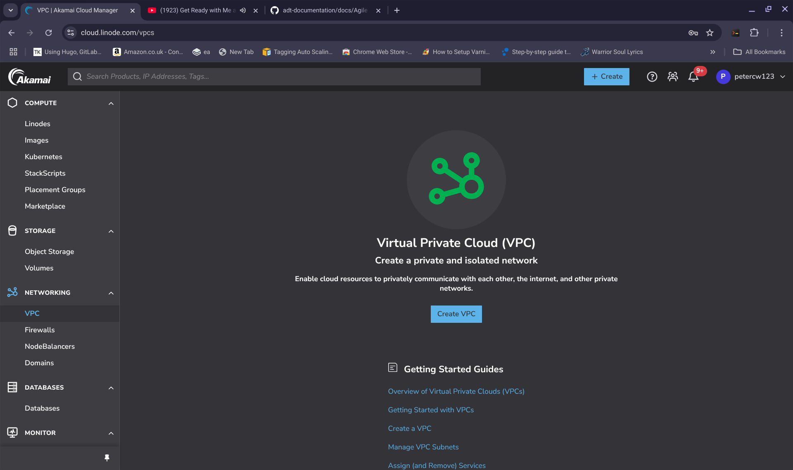
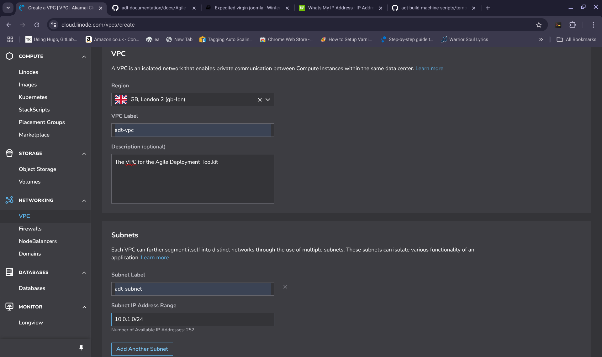
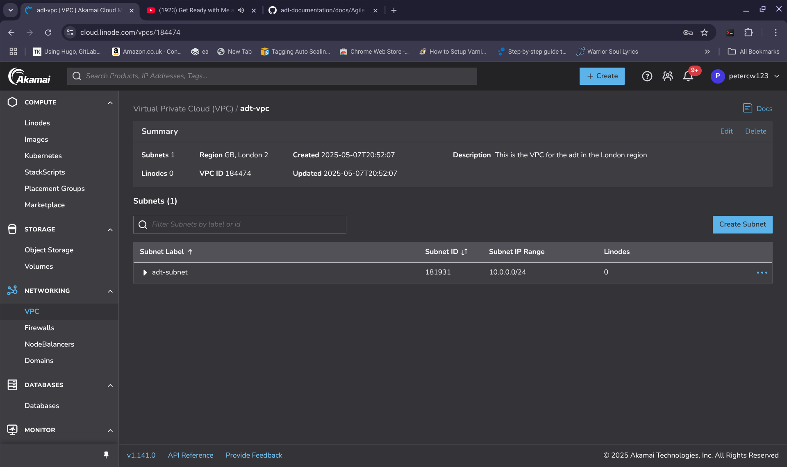
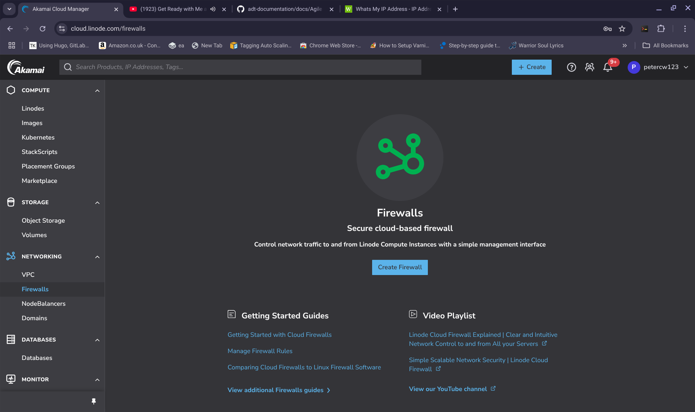
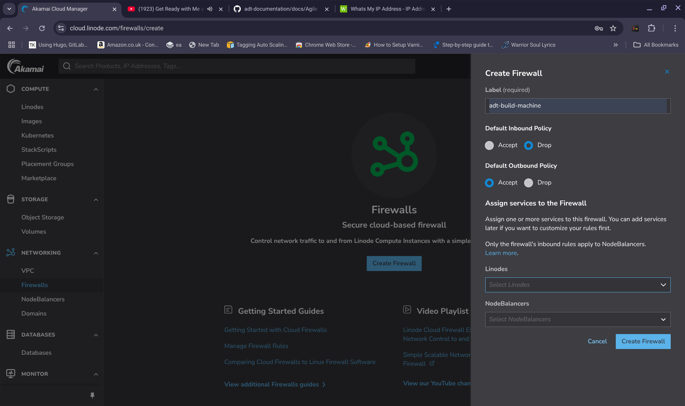
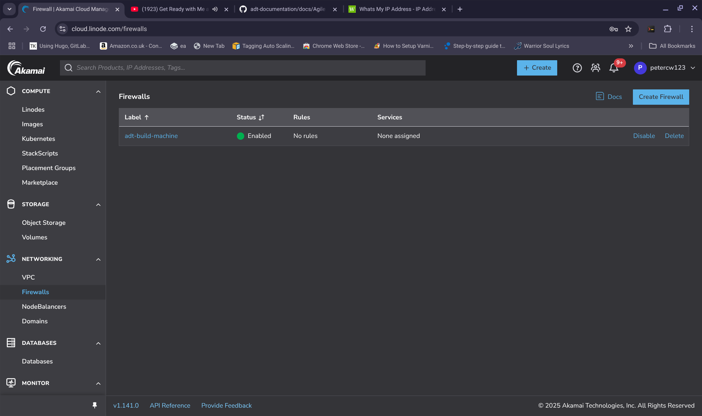
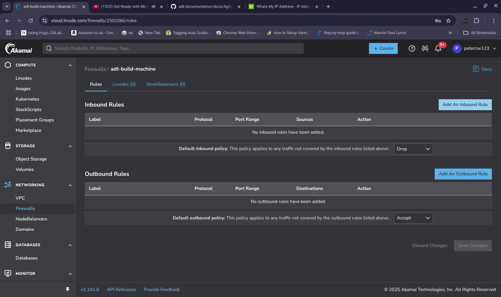
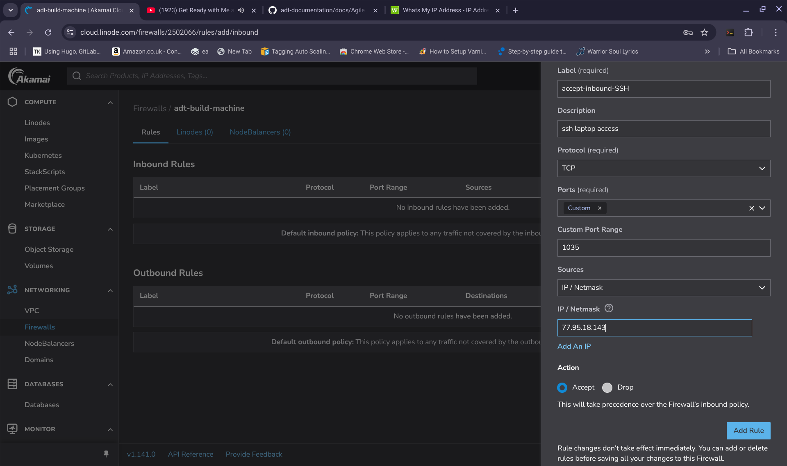
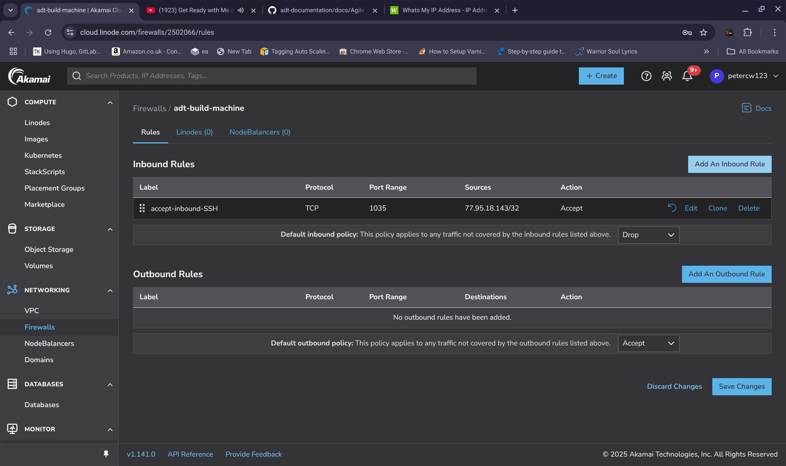

**PRE BUILD PREPARATIONS FOR BUILD MACHINE** 

Before performing an expedited or full build, you need to set up a build machine. The way you do this for Linode is as follows:

----------------

1) If you don't have an SSH key pair issue the following command:
 
>     /usr/bin/ssh-keygen -t rsa -b 4096 

Your key will be saved to the indicated file, for example, **/root/.ssh/id_rsa** your path might be different such as **/home/bob/.ssh/id_rsa**
	 
Issue the command (for example)
	 
>     /bin/cat /root/.ssh/id_rsa.pub - this will be your <ssh-public-key-substance>
 	 
This will give you your **public** key which we will refer to again, later on.

--------------------
	
2) Choose the first option here if you are using an expedited style build and the second option if you are deploying a hardcore type build
   
- **EXPEDITED BUILD STYLE**: Paste a copy of the script: [Initial Script](https://github.com/wintersys-projects/adt-build-machine-scripts/blob/main/templatedconfigurations/templateoverrides/OverrideScript.sh) into an open text file on your laptop.

- **HARDCORE BUILD STYLE**: Paste a copy of your fully configured userdata script which you generated by following [Hardcore Deployment Method](./hardcore-deployment-method.md)  into an open text file on your laptop.
(note, if your servers are still running from an expedited build you most likely want to shut them down and destroy them once you have a copy of your hardcore build style userdata script on your laptop)

------------------
	
3) If you look into the script that you made a copy of in 2, you need to populate the following variables in your copy:
	
>     export BUILDMACHINE_USER=""
>     export BUILDMACHINE_PASSWORD="" 
>     export BUILDMACHINE_SSH_PORT=""
>     export LAPTOP_IP=""
	
>     export SSH=\"\" 
	 	
Now you need to decide on a username for your build machine, a password for your build machine, a port for your build machine's ssh system and the IP address of your desktop or laptop.
	
If I decide on a username of "wintersys-projects" then in the copy that I made in 2, I need to change it as follows:  

>     export BUILDMACHINE_USER="wintersys-projects"
	
If I decide on a password of "QQQPPPZZZMMM123098" then in the copy that I made in 2, I need to change it as follows:
	
>     export BUILDMACHINE_PASSWORD="QQQPPPZZZMMM123098"
	
If you decide on an SSH_PORT of "1035" then in the copy that I made in 2, I need to change it as follows:
	
>     export BUILDMACHINE_SSH_PORT="1035"

You need to give the script your laptop IP address. You can do this by going to [what's my ip](https://www.whatsmyip.com)and so, if your ip address is: "111.111.111.111" and pasting your ip address into your copy as follows:
	
>     export LAPTOP_IP="111.111.111.111"

Obtain the substance of your ssh public key like you did in 1.

>     /bin/cat /root/.ssh/id_rsa.pub - this will be your <ssh-public-key-substance>

The **public** ssh key that you took a copy of in 1 needs to be pasted as follows and also added using the ssh key GUI system:
	
>     export SSH=\"<ssh-public-key-substance>\"

The top part of the copy that you made in 2 will now look like this:

>     #!/bin/sh
>     
>     ################################################################################################
>     # This script is a preparatory script for your build machine. Your build machine is the machine
>     # that is responsible for initiating the build process of your server fleet. 
>     # As a minimum you will need a copy of this script with the following dynamic or changeable values 
>     # set:
>     #
>     #   BUILDMACHINE_USER
>     #   BUILDMACHINE_PASSWORD
>     #   BUILDMACHINE_SSH_PORT
>     #   LAPTOP_IP
>     #   SSH
>     #
>     # You will then need to pass a copy of the entire script with these values set to the "user data"
>     # area of the build machine you are provisioning. How to do this will vary by provider.
>     # Once your build machine is provisioned you can SSH onto it in a way similar to this:
>     #
>     #     > ssh -i <ssh-private-key> -p ${BUILDMACHINE_SSH_PORT} ${BUILDMACHINE_USER}@<buildmachineip>
>     #     > sudo su
>     #     > password:${BUILDMACHINE_PASSWORD}
>     #     > cd adt-build-machine-scripts
>     #
>     #################################################################################################
>     export BUILDMACHINE_USER="wintersys-projects"
>     export BUILDMACHINE_PASSWORD="QQQPPPZZZMMM123098" #Make sure any password you choose is strong enough to pass any strength enforcement rules of your OS
>     export BUILDMACHINE_SSH_PORT="1035"
>     export LAPTOP_IP="111.111.111.111"
>      
>     /bin/echo "
>     #BASE OVERRIDES
>     export SSH=\"ssh-rsa AAAAB3NzaC1yc2EAAAADAQABAAABAQDEgqlNPY9uh6SpihNXm/7XGqOKvAcH8Z0Y6pZG9lTIm/PHI5VijIFqs0OzM3DPLFARtut7lojBoKq9ljBmKeVBGX5EkJ5O3CJfEZs9E13e2Qk+7F9wTmoMBG8XY4l/SmD9HddLTS/7Oadg+C4RDxHlSMrl1PSCdzlM14spHCI8rwUntNCUY+fObolqel0829zYDX0oEWzYyoIEUs1847X3cRp9+yZsjqSD5Nw9jacLcWjtdfClEvx5F8ZVm0+s5OLtz9cCf6NkOgYf3KFz+e8qAO/w83Umh5B2Gem1uOxSDtUmzVlRiMTfP6CTSKRnYRnkb97F9RZsmAsG6+g+eKvp root@penguin\" #paste your public key here
>     
>     The rest of the script will appear below here

-----------------

**ADDITIONAL STEP FOR HARDCORE BUILD STYLE**  

If you are performing a hardcore build style then you need to additionally set the value of SELECTED_TEMPLATE to your user data script. SELECTED_TEMPLATE will be "1" if you are performing a virgin build, "2" if you are performing a baseline build, and, "3" if you are performing a temporal build.

>     export SELECTED_TEMPLATE="1"

-----------------

4) Take a copy of this entire updated script and keep it safe because you will likely want to use this script multiple times in future deployments remember that anyone who has a copy of this script has some sensitive information about your build machine 

---------------
	
5) What you need to do now is to use this script to spin up your build machine and you will do this by pasting it into the "user data" area of your build machine.

You will need to create a private network called **PRECISELY** "adt-vpc" in the "gb-lon" region

You will need to create a firewall for your build machine. You can do this as follows:
	
Click on the firewalls option of your linode GUI and follow what is shown in these images. You need to allow access to your build machine from your laptop to the port you have defined above (in my case 1035)

You can then see your new Firewall "adt-build-machine" listed which you will attach to your "build machine" later on
	
---------------

7) You need to spin up a small machine to be your build machine by clicking "Add" on the top right of the GUI. And then follow these steps:

>     1. Select which template you want debian 12 or ubuntu 24.04
>     2. Select which zone you want to deploy to, for example, CH-GVA-2
>     3. Select instance type "Tiny" for example
>     4. Select disk size (50GB)
>     5. Add the build machine to the "adt_private_net_ch-gva-2" security group
>     6. Ignore the SSH KEY in the GUI (the system will get this from the "SSH" value that you pasted into your user data script above)
>     7. Make sure your build machine is added to the security group "adt-build-machine" and deselect the "default" security group if it is selected. 
>     8. In the "User Data" area of your VPC machine, paste the entire script that you were left with from 4.
>     9. Click Create and wait for your machine to build

Graphically you can see what I have described in these 8 steps here:
	
  
  
	
---------------

8) Once the machine has built you can access it as follows:

  
	
>     Discover what the machine's IP address is by looking at the Exoscale GUI system for the IP address of the build machine - In this case: 185.19.29.134
	
Now on your laptop issue the command:

>     ssh -i /root/.ssh/id_rsa -p ${BUILDCLIENT_SSH_PORT} $BUILDCLIENT_USER@<buildmachineip>
	
or yours might be:
	
>     ssh -i /home/${username}/.ssh/id_rsa -p ${BUILDCLIENT_SSH_PORT} ${BUILDCLIENT_USER}@<buildmachineip>	

Once logged in to your build machine

>     sudo su 
>     [sudo] password for wintersys-projects:

And then enter your build machine password	

>     ${BUILDMACHINE_PASSWORD}		
	
In Graphical form, if you change directory to your toolkit home directory and list it should look like:
	

		
--------------------------------------
