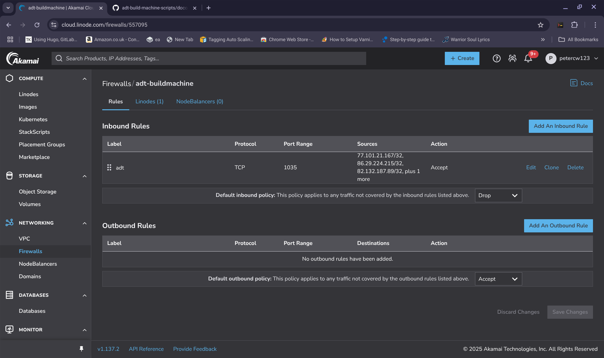
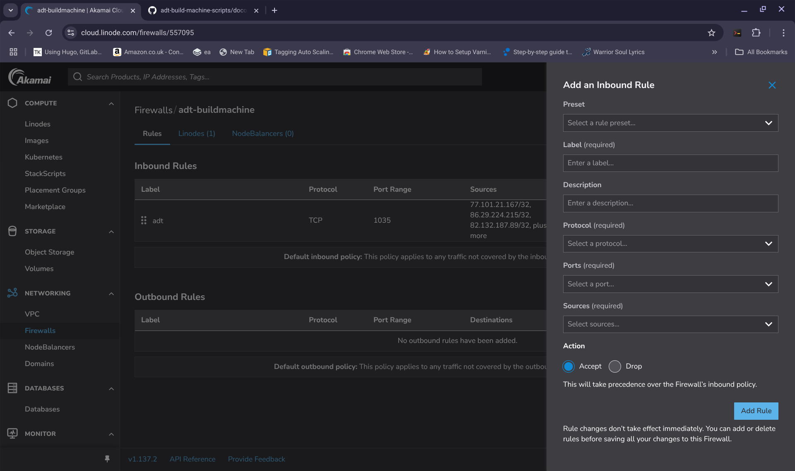
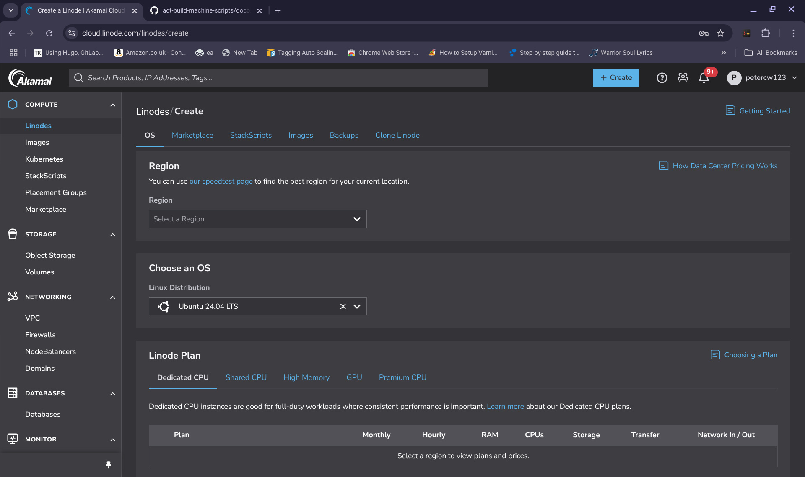
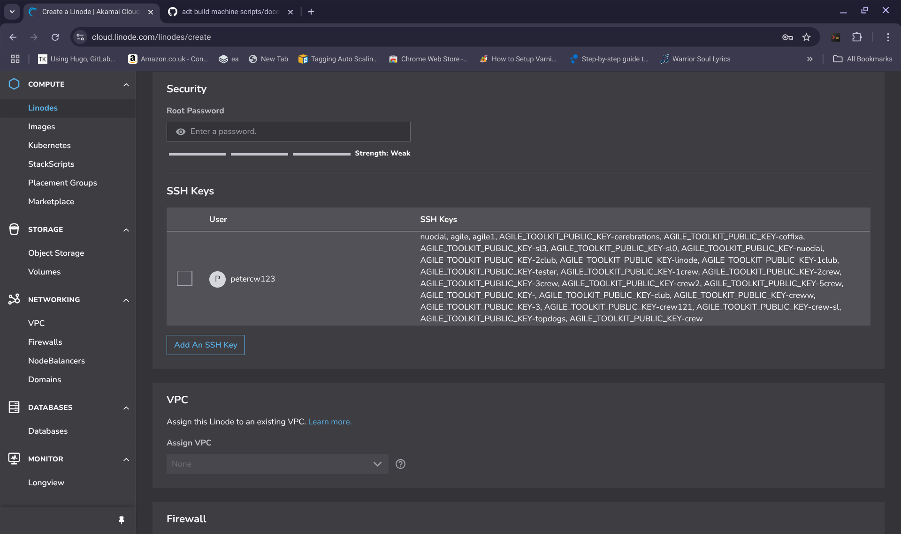
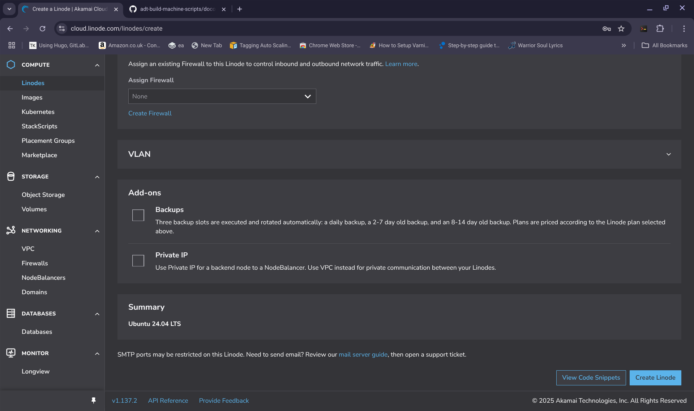
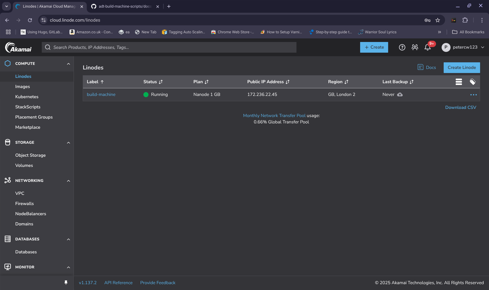
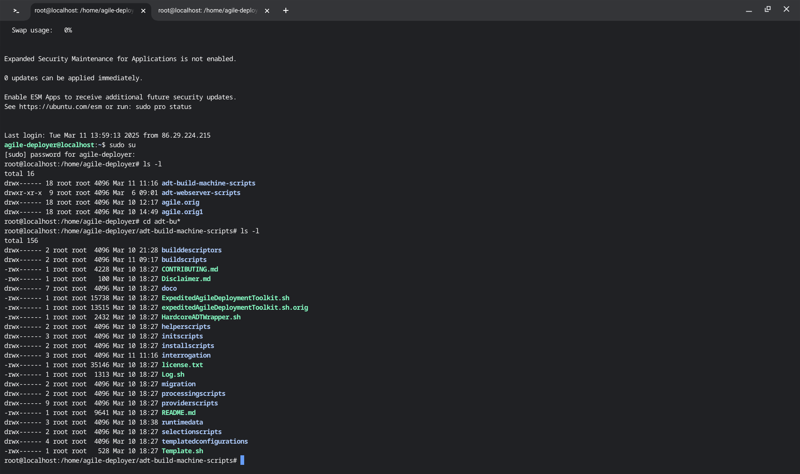

PRE BUILD PREPARATIONS FOR HARDCORE BUILDS:

Before performing an Hardcore build, you need to set up a build machine. The way you do this for Linode is as follows:

First of all you need to generate your userdata script and you can do that by following the hardcore instructions part of 

[Generate Hardcore Userdata](../../Deployment/BuildMethodTypesOverview.md)

Once you have a fully populated userdata script, store it somewhere safe

----------------

1) If you don't have an SSH key pair or if you want a specific SSH key pair for your builds, issue the following command:
 
>     /usr/bin/ssh-keygen -t rsa 

Your key will be saved to the indicated file, for example, **/root/.ssh/id_rsa** your path might be different such as **/home/bob/.ssh/id_rsa**
	 
Issue the command (for example)
	 
>     /bin/cat /root/.ssh/id_rsa.pub - this will be your <ssh-public-key-substance>
 	 
This will give you your **public** key which you need later so, take a copy of the output that is printed to the screen. 

--------------------
	
2) Take on your laptop, take a copy of your userdata script that you should have previously generated as described above from  

>     ${BUILD_HOME}/adt-build-machine-scripts/userdatascripts/${userdatascript})  
	
where ${userdatascript} is the name you have given to your userdata script. 

------------------
	
3) If you look into the script that you made a copy of in 2, you need to populate the following variables in your copy:
	
>     export BUILDMACHINE_USER=""
>     export BUILDMACHINE_PASSWORD="" 
>     export BUILDMACHINE_SSH_PORT=""
>     export LAPTOP_IP=""
	
>     export SSH=\"\" 
	 	
Now you need to decide on a username for your build machine, a password for your build machine, a port for your build machine's ssh system and the IP address of your desktop or laptop.
	
If I decide on a username of "wintersys-projects" then in the copy that I made in 2, I need to change it as follows:  

>     export BUILDMACHINE_USER="wintersys-projects"
	
If I decide on a password of "QQQPPPZZZMMM123098" then in the copy that I made in 2, I need to change it as follows:
	
>     export BUILDMACHINE_PASSWORD="QQQPPPZZZMMM123098"
	
If you decide on an SSH_PORT of "1035" then in the copy that I made in 2, I need to change it as follows:
	
>     export BUILDMACHINE_SSH_PORT="1035"

You need to give the script your laptop IP address. You can do this by going to https://www.whatsmyip.com and so, if your ip address is: "111.111.111.111" and pasting your ip address into your copy as follows:
	
>     export LAPTOP_IP="111.111.111.111"
	
The **public** ssh key that you took a copy of in 1 needs to be pasted as follows and also added using the ssh key GUI system:
	
>     export SSH=\"<ssh-public-key-substance>\"

The top part of the copy that you made in 2 will now look like this:

>     #!/bin/bash
>    
>     /bin/mkdir /root/logs
>    
>     OUT_FILE="webserver-build-out-`/bin/date | /bin/sed 's/ //g'`"
>     exec 1>>/root/logs/${OUT_FILE}
>     ERR_FILE="webserver-build-err-`/bin/date | /bin/sed 's/ //g'`"
>     exec 2>>/root/logs/${ERR_FILE}
>     
>     ###############################################################################################
>     # SET THESE FOR YOUR BUILD CLIENT MACHINE
>     # THIS WILL NOT START A BUILD IT WILL JUST SETUP THE TOOLKIT
>     # USE THIS IF YOU WANT TO PERFORM AN EXPEDITED OR A FULL BUILD FROM THE COMMAND LINE
>     # ssh -i <ssh-private-key> -p ${BUILDCLIENT_SSH_PORT} $BUILDCLIENT_USER@<buildclientip>
>     # $BUILDCLIENT_USER>sudo su
>     # password:${BUILDCLIENT_PASSWORD}
>     # cd adt-build-machine-scripts/logs
>     #################################################################################################
>     export BUILDMACHINE_USER="wintersys-projects"
>     export BUILDMACHINE_PASSWORD="QQQPPPZZZMMM123098" #Make sure any password you choose is strong enough to pass any strength enforcement rules of your OS
>     export BUILDMACHINE_SSH_PORT="1035"
>     export LAPTOP_IP="111.111.111.111"
>      
>     /bin/echo "
>     #BASE OVERRIDES
>     export SSH=\"ssh-rsa AAAAB3NzaC1yc2EAAAADAQABAAABAQDEgqlNPY9uh6SpihNXm/7XGqOKvAcH8Z0Y6pZG9lTIm/PHI5VijIFqs0OzM3DPLFARtut7lojBoKq9ljBmKeVBGX5EkJ5O3CJfEZs9E13e2Qk+7F9wTmoMBG8XY4l/SmD9HddLTS/7Oadg+C4RDxHlSMrl1PSCdzlM14spHCI8rwUntNCUY+fObolqel0829zYDX0oEWzYyoIEUs1847X3cRp9+yZsjqSD5Nw9jacLcWjtdfClEvx5F8ZVm0+s5OLtz9cCf6NkOgYf3KFz+e8qAO/w83Umh5B2Gem1uOxSDtUmzVlRiMTfP6CTSKRnYRnkb97F9RZsmAsG6+g+eKvp root@penguin\" #paste your public key here
>     
>     The rest of the script will appear below here

-----------------

4) Take a copy of this entire updated script and keep it safe because you will likely want to use this script multiple times in future deployments remember that anyone who has a copy of this script you have made has enough information to access the build machine you are going to deploy in a minute. 

---------------
	
5) What you need to do now is to use this script to spin up your build machine and you will do this by pasting it into the user data area of your build machine.

You will need to create a setup a firewall for your build machine. You can do this as follows:
	
Click on the firewalls option of your Linode GUI

Click "Create Firewall" and call it **PRECISELY** "adt-build-machine" and click "Create Firewall"

You can then see your Firewall "adt-build-machine" listed  
	
6) Add rules to the "adt-build-machine" Firewall to allow pinging and your build client to connect.  
	
So you will need to add 2 rules  
	
1) Ping  
2) A rule to allow acccess to your build machines defined SSH_PORT from your laptop.  
   If you SSH_PORT is 1035 and your laptop IP is 111.111.111.111 then you will need a TCP rule with "CIDR 111.111.111.111/32 1035"
	

---------------

7) You need to spin up a small machine to be your build machine by clicking "Create Linode" on the top right of the GUI. And then follow these steps:

>     1. Select which region you want to deploy your buid machine in (should be same region as your main servers)
>     1. Select which Linux Distribution you want debian 10 (or later) or ubuntu 20.04 (or later)
>     3. Select instance type "Shared CPU -> Nanode" for example
>     4. Provide a Label for your linode for example  "adt-buildmachine"
>     4. Set a root password
>     5. Ignore SSH KEY
>     6. Attach the build machine to your VPC
>     7. Assing the Linode to the firewall you created
>     8. Paste the "UserData" script that you created above into the "User Data" area
>     9. Click Create and wait for your machine to build

Graphically you can see what I have described in these 9 steps here:
	

---------------

8) Once the machine has built you can access it as follows:
	
	
>     Discover what the machine's IP address is by looking at the Exoscale GUI system for the IP address of the build machine - In this case: 185.19.29.134
	
Now on your laptop issue the command:

>     ssh -i /root/.ssh/id_rsa -p ${BUILDCLIENT_SSH_PORT} $BUILDCLIENT_USER@<buildmachineip>
	
or yours might be:
	
>     ssh -i /home/${username}/.ssh/id_rsa -p ${BUILDCLIENT_SSH_PORT} $BUILDCLIENT_USER@<buildmachineip>	

Once logged in to your build machine

>     sudo su 
>     [sudo] password for wintersys-projects:

And then enter your build machine password	

>     ${BUILDMACHINE_PASSWORD}		
	
In Graphical form, it looks like this:

