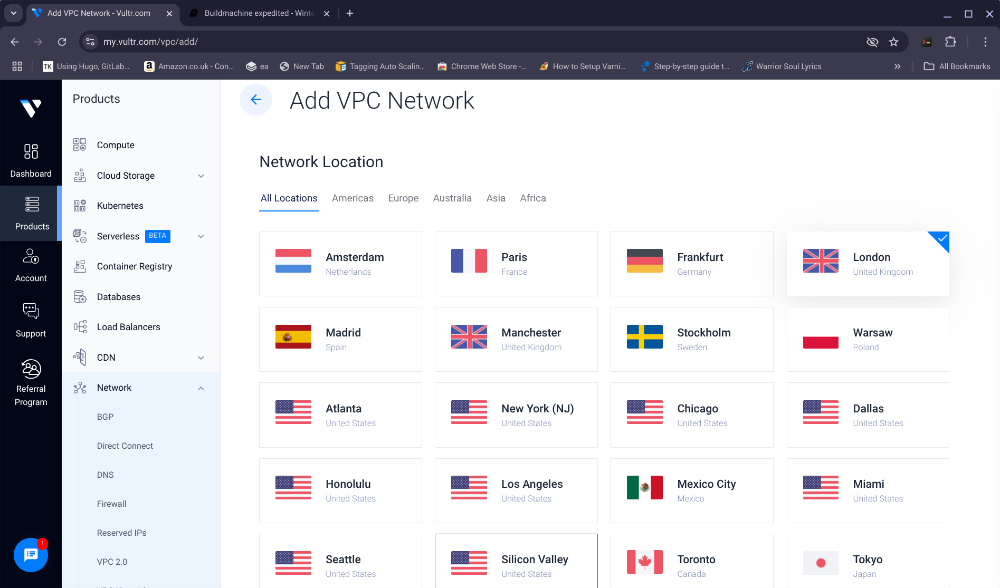
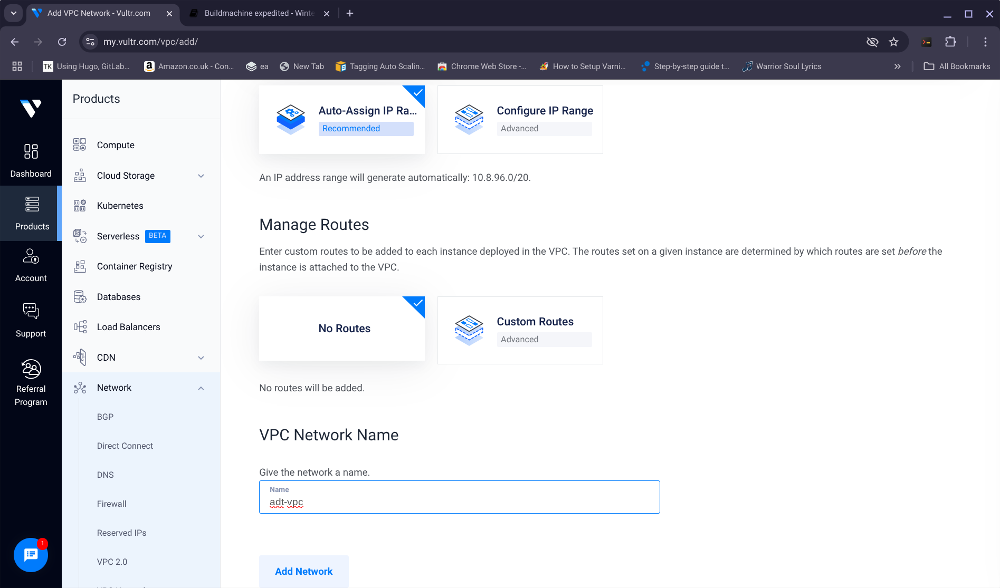
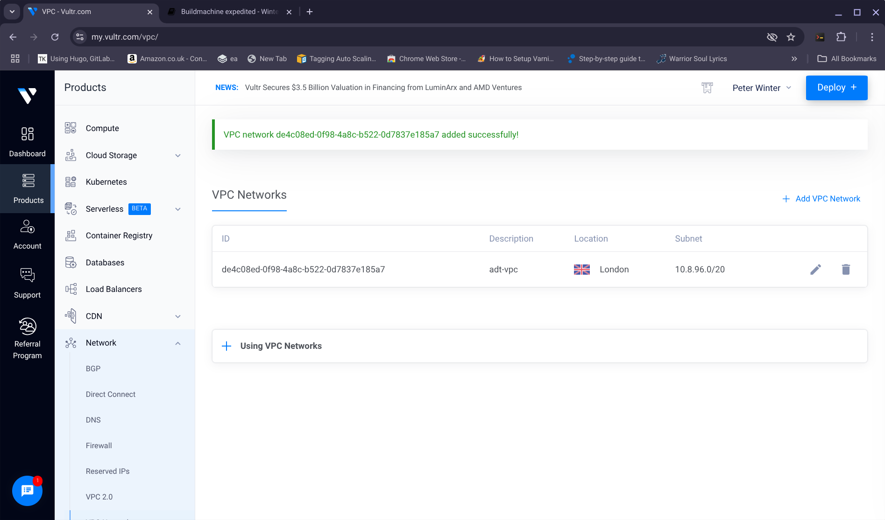
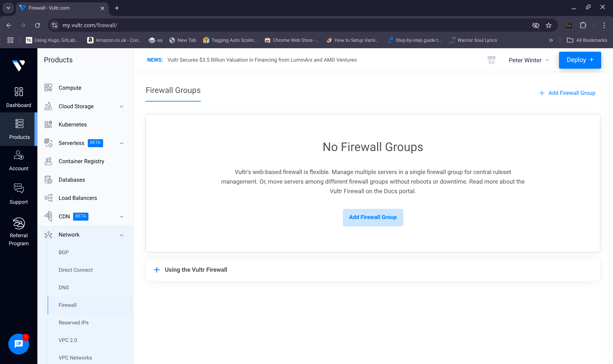
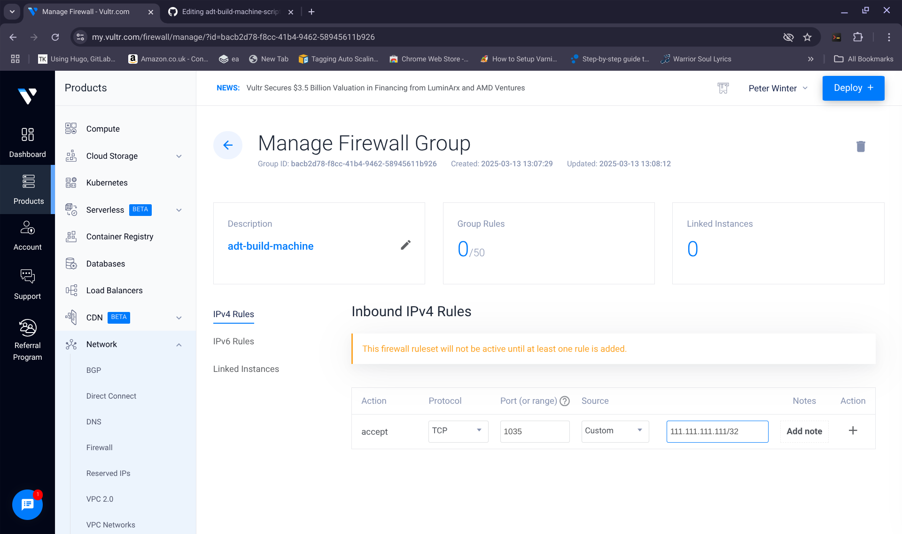
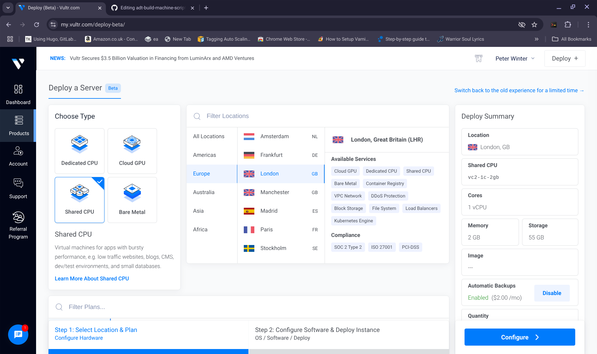
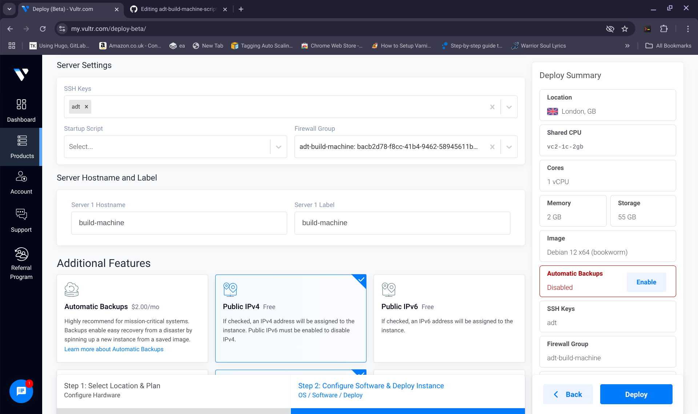
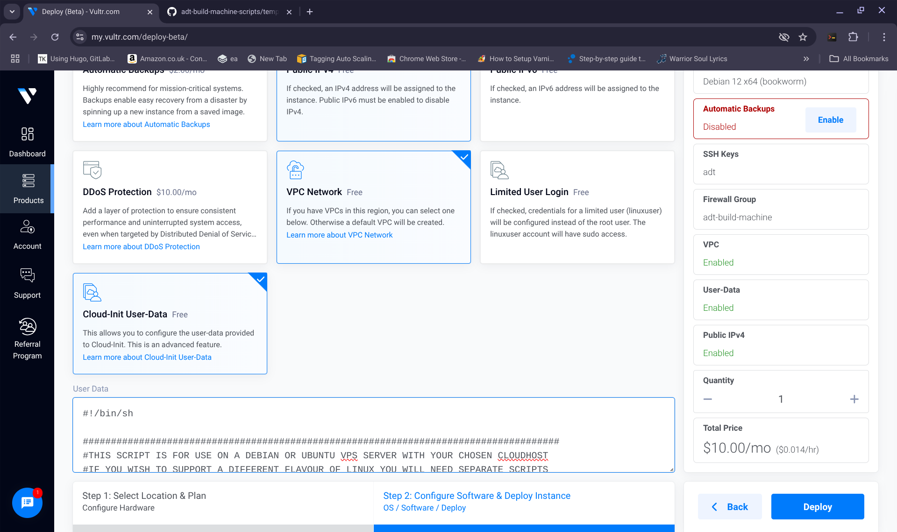
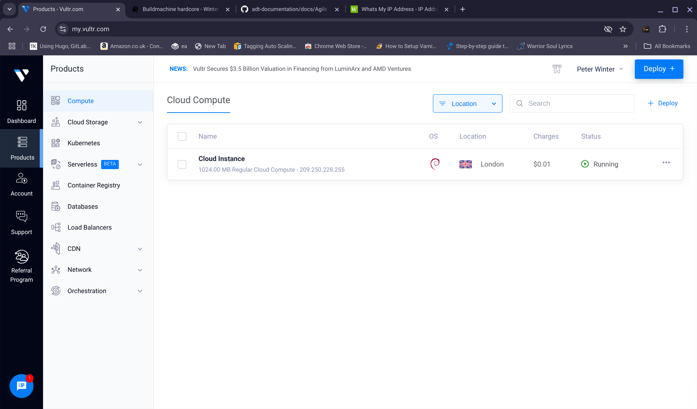
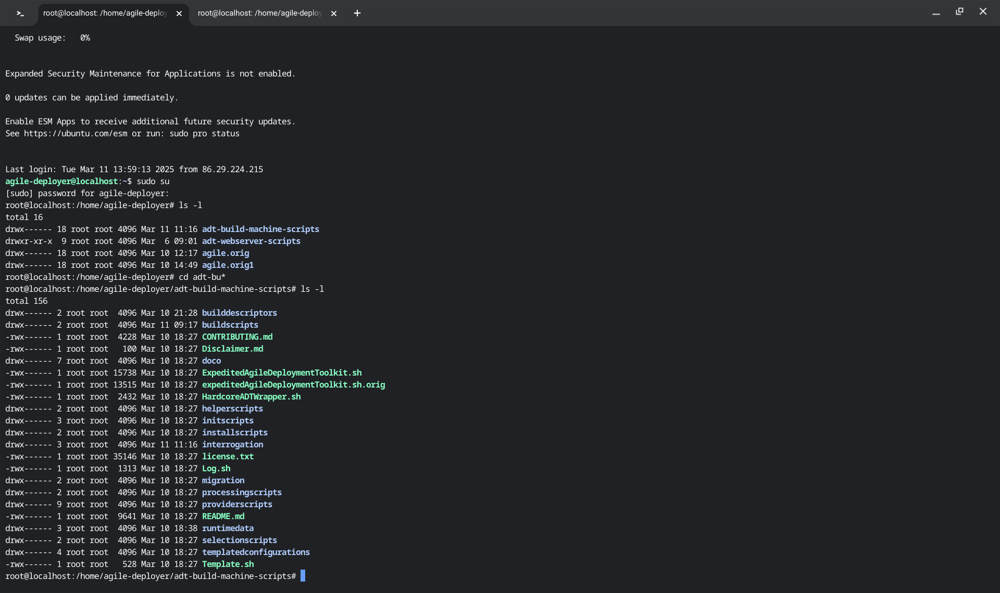

**PRE BUILD PREPARATIONS FOR EXPEDITED BUILDS:**

Before performing an expedited or full build, you need to set up a build machine. The way you do this for Vultr is as follows:

----------------

1) If you don't have an SSH key pair issue the following command:
 
>     /usr/bin/ssh-keygen -t rsa -b 4096 

Your key will be saved to the indicated file, for example, **/root/.ssh/id_rsa** your path might be different such as **/home/bob/.ssh/id_rsa**
	 
Issue the command (for example)
	 
>     /bin/cat /root/.ssh/id_rsa.pub - this will be your <ssh-public-key-substance>
 	 
This will give you your **public** key which we will refer to again, later on.

--------------------
	
2) Paste a copy of the script: [Initial Script](https://github.com/wintersys-projects/adt-build-machine-scripts/blob/main/templatedconfigurations/templateoverrides/OverrideScript.sh) into an open text file on your laptop. 

------------------
	
3) If you look into the script that you made a copy of in 2, you need to populate the following variables in your copy:
	
>     export BUILDMACHINE_USER=""
>     export BUILDMACHINE_PASSWORD="" 
>     export BUILDMACHINE_SSH_PORT=""
>     export LAPTOP_IP=""
	
>     export SSH=\"\" 
	 	
Now you need to decide on a username for your build machine, a password for your build machine, a port for your build machine's ssh system and the IP address of your desktop or laptop.
	
If I decide on a username of "wintersys-projects" then in the copy that I made in 2, I need to change it as follows:  

	
>     export BUILDMACHINE_USER="wintersys-projects"
	
If I decide on a password of "QQQPPPZZZMMM123098" then in the copy that I made in 2, I need to change it as follows:
	
>     export BUILDMACHINE_PASSWORD="QQQPPPZZZMMM123098"
	
If you decide on an SSH_PORT of "1035" then in the copy that I made in 2, I need to change it as follows:
	
>     export BUILDMACHINE_SSH_PORT="1035"

You need to give the script your laptop IP address. You can do this by going to https://www.whatsmyip.com and so, if your ip address is: "111.111.111.111" and pasting your ip address into your copy as follows:
	
>     export LAPTOP_IP="111.111.111.111"

Obtain the substance of your ssh public key like you did in 1.

>     /bin/cat /root/.ssh/id_rsa.pub - this will be your <ssh-public-key-substance>

The **public** ssh key that you took a copy of in 1 needs to be pasted as follows and also added using the ssh key GUI system:
	
>     export SSH=\"<ssh-public-key-substance>\"

The top part of the copy that you made in 2 will now look like this:

>     #!/bin/sh
>     
>     ################################################################################################
>     # This script is a preparatory script for your build machine. Your build machine is the machine
>     # that is responsible for initiating the build process of your server fleet. 
>     # As a minimum you will need a copy of this script with the following dynamic or changeable values 
>     # set:
>     #
>     #   BUILDMACHINE_USER
>     #   BUILDMACHINE_PASSWORD
>     #   BUILDMACHINE_SSH_PORT
>     #   LAPTOP_IP
>     #   SSH
>     #
>     # You will then need to pass a copy of the entire script with these values set to the "user data"
>     # area of the build machine you are provisioning. How to do this will vary by provider.
>     # Once your build machine is provisioned you can SSH onto it in a way similar to this:
>     #
>     #     > ssh -i <ssh-private-key> -p ${BUILDMACHINE_SSH_PORT} ${BUILDMACHINE_USER}@<buildmachineip>
>     #     > sudo su
>     #     > password:${BUILDMACHINE_PASSWORD}
>     #     > cd adt-build-machine-scripts
>     #
>     #################################################################################################
>     export BUILDMACHINE_USER="wintersys-projects"
>     export BUILDMACHINE_PASSWORD="QQQPPPZZZMMM123098" #Make sure any password you choose is strong enough to pass any strength enforcement rules of your OS
>     export BUILDMACHINE_SSH_PORT="1035"
>     export LAPTOP_IP="111.111.111.111"
>      
>     /bin/echo "
>     #BASE OVERRIDES
>     export SSH=\"ssh-rsa AAAAB3NzaC1yc2EAAAADAQABAAABAQDEgqlNPY9uh6SpihNXm/7XGqOKvAcH8Z0Y6pZG9lTIm/PHI5VijIFqs0OzM3DPLFARtut7lojBoKq9ljBmKeVBGX5EkJ5O3CJfEZs9E13e2Qk+7F9wTmoMBG8XY4l/SmD9HddLTS/7Oadg+C4RDxHlSMrl1PSCdzlM14spHCI8rwUntNCUY+fObolqel0829zYDX0oEWzYyoIEUs1847X3cRp9+yZsjqSD5Nw9jacLcWjtdfClEvx5F8ZVm0+s5OLtz9cCf6NkOgYf3KFz+e8qAO/w83Umh5B2Gem1uOxSDtUmzVlRiMTfP6CTSKRnYRnkb97F9RZsmAsG6+g+eKvp root@penguin\" #paste your public key here
>     
>     The rest of the script will appear below here

-----------------

4) Take a copy of this entire updated script and keep it safe because you will likely want to use this script multiple times in future deployments remember that anyone who has a copy of this script has some sensitive information about your build machine   

---------------

5) What you need to do now is to use this script to spin up your build machine and you will do this by pasting it into the user data area of your build machine.

You will need to create a VPC for your machines to attach to. You should call your VPC "adt-vpc" and you can see me creating my VPC in the following images:

You will need to create a firewall for your build machine. You can do this by creating a firewall on this page:

Click on the Networking main option and the "firewalls" sub option of your vultr GUI

 
Click "Create Firewall" and call it **PRECISELY** "adt-build-machine". Remove all inbound rules and keep the outbound rules as they are set

You can then see your new firewall "adt-build-machine" listed  

-------------------

6) Add rules to the "adt-build-machine" firewall to allow pinging and your build client to connect.  

So you will need to add 2 rules  

1) Ping  
2) A rule to allow acccess to your build machines defined SSH_PORT from your laptop.  
   If you SSH_PORT is 1035 and your laptop IP is 111.111.111.111 then you will need a TCP rule with "CIDR 111.111.111.111/32 1035"

You can see in this image that port 1035 is about to be opened up to the ip address of my laptop 111.111.111.111/32  

---------------

7) You need to spin up a small machine to be your build machine by clicking "Create Server" on the top right of the GUI. And then follow these steps:

>     1. Select which template you want debian 10 (or later) or ubuntu 20.04 (or later)
>     2. Select which region you want to deploy to, for example, london
>     3. Select instance size "1GB" for example
>     4. Add the machine to a VPC called "adt-vpc" in your current region
>     5. In the "User Data" area of your machine, paste the entire script that you were left with from 4.
>     6. Click Create and wait for your machine to build
>     7. Once the machine has built, go to "networking" -> "firewalls" and select "adt-build-machine" firewall and add your new droplet to the firewall

Graphically you can see what I have described in these 8 steps here:

---------------

8) Once the machine has built you can access it as follows: 

>     Discover what the machine's IP address is by looking at the Vultr GUI system for the IP address of the build machine - You can see in the image below where the IP address is, in this case: 209.250.228.255

Now on your laptop issue the command:

>     ssh -i /root/.ssh/id_rsa -p ${BUILDCLIENT_SSH_PORT} $BUILDCLIENT_USER@<buildmachineip>

or yours might be:

>     ssh -i /home/${username}/.ssh/id_rsa -p ${BUILDCLIENT_SSH_PORT} $BUILDCLIENT_USER@<buildmachineip>

Once logged in to your build machine

>     sudo su 
>     [sudo] password for wintersys-projects:

And then enter your build machine password 

>     ${BUILDMACHINE_PASSWORD}

In Graphical form, if you change directory to your toolkit home directory and list it should look like:

